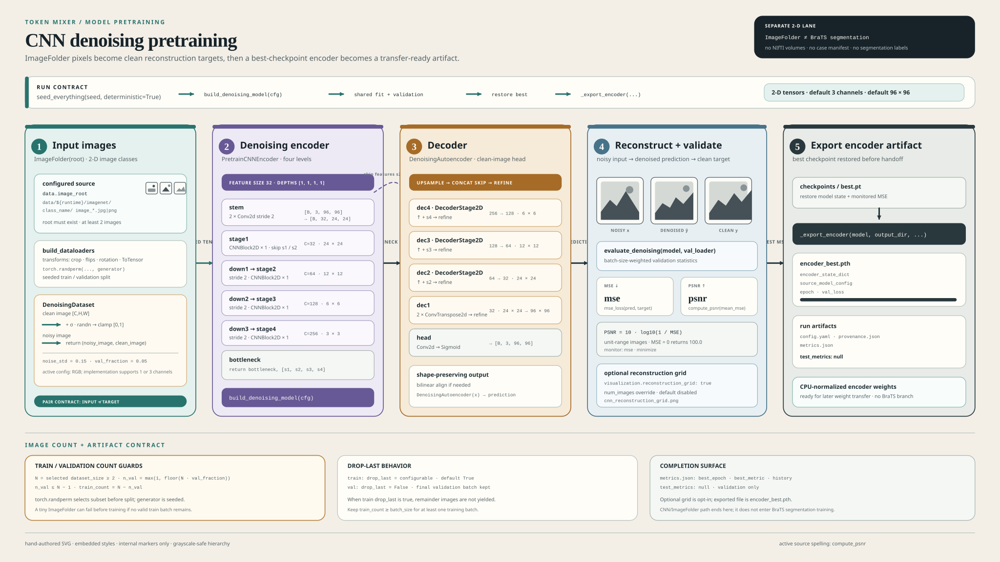

# CNN Denoising Pretraining

This guide documents the active 2-D ImageFolder denoising pretraining path. It
trains a convolutional encoder and decoder to reconstruct clean images from
synthetically noisy images, then exports the best encoder weights as
`encoder_best.pth`. This is a separate pretraining experiment, not a BraTS
segmentation run.

Shared Hydra composition, fit-engine, artifact, and reproducibility contracts
remain owned by [CONFIG.md](CONFIG.md), [TRAINING.md](TRAINING.md), and
[REPRODUCIBILITY.md](REPRODUCIBILITY.md). ImageFolder layout and transform
background live in [DATA.md](DATA.md); this guide records the CNN-specific
details that those cross-cutting guides do not own.



## Source Map

Claims in this guide are grounded in active implementation, configuration, and
tests:

- [`src/token_mixer/models/cnn_pretrain.py::DenoisingDataset`](../src/token_mixer/models/cnn_pretrain.py#L185-L229)
- [`src/token_mixer/models/cnn_pretrain.py::PretrainCNNEncoder`](../src/token_mixer/models/cnn_pretrain.py#L266-L341)
- [`src/token_mixer/models/cnn_pretrain.py::DecoderStage2D`](../src/token_mixer/models/cnn_pretrain.py#L344-L368)
- [`src/token_mixer/models/cnn_pretrain.py::DenoisingAutoencoder`](../src/token_mixer/models/cnn_pretrain.py#L371-L430)
- [`src/token_mixer/models/cnn_pretrain.py::build_denoising_model`](../src/token_mixer/models/cnn_pretrain.py#L433-L435)
- [`src/token_mixer/models/cnn_pretrain.py::mse_loss`](../src/token_mixer/models/cnn_pretrain.py#L438-L440)
- [`src/token_mixer/models/cnn_pretrain.py::compute_psnr`](../src/token_mixer/models/cnn_pretrain.py#L443-L453)
- [`src/token_mixer/models/cnn_pretrain.py::evaluate_denoising`](../src/token_mixer/models/cnn_pretrain.py#L475-L500)
- [`src/token_mixer/pipelines/pretrain_cnn.py::build_dataloaders`](../src/token_mixer/pipelines/pretrain_cnn.py#L228-L324)
- [`src/token_mixer/pipelines/pretrain_cnn.py::run_cnn_denoising_pretrain`](../src/token_mixer/pipelines/pretrain_cnn.py#L755-L859)
- [`configs/data/imagenet.yaml`](../configs/data/imagenet.yaml#L1-L8)
- [`configs/model/cnn_pretrain.yaml`](../configs/model/cnn_pretrain.yaml#L1-L8)
- [`configs/experiment/cnn_denoising_pretrain.yaml`](../configs/experiment/cnn_denoising_pretrain.yaml#L1-L33)
- [`configs/run/debug.yaml`](../configs/run/debug.yaml#L1-L17) and [`configs/run/full.yaml`](../configs/run/full.yaml#L1-L17)
- [`configs/local.yaml`](../configs/local.yaml#L1-L32) and [`configs/cloud.yaml`](../configs/cloud.yaml#L1-L32)
- [`src/token_mixer/reproducibility.py::{seed_everything,seed_worker}`](../src/token_mixer/reproducibility.py#L9-L28)
- [`src/token_mixer/training/engine.py::{FitResult,fit}`](../src/token_mixer/training/engine.py#L21-L791)
- [`src/token_mixer/training/checkpoints.py::CheckpointManager`](../src/token_mixer/training/checkpoints.py#L207-L470)
- [`src/token_mixer/training/artifacts.py::write_run_artifacts`](../src/token_mixer/training/artifacts.py#L101-L214)
- [`src/token_mixer/cli.py::{_dispatch,_run}`](../src/token_mixer/cli.py#L39-L105)
- [`tests/models/test_cnn_pretrain.py`](../tests/models/test_cnn_pretrain.py#L19-L116)
- [`tests/pipelines/test_pretrain_cnn.py`](../tests/pipelines/test_pretrain_cnn.py#L244-L319)
- [`tests/pipelines/test_pretrain_cnn.py` reconstruction and export contracts](../tests/pipelines/test_pretrain_cnn.py#L480-L696)
- [`tests/training/test_artifacts.py::test_write_run_artifacts_persists_metrics_and_provenance`](../tests/training/test_artifacts.py#L11-L48)

The active metric symbol is `compute_psnr`, with lowercase `psnr`.

## Purpose And Boundary

The CLI selects this path with `experiment=cnn_denoising_pretrain`. The
selector dispatches to `run_cnn_denoising_pretrain`, which builds the model,
ImageFolder loaders, MSE loss, denoising evaluator, one `pretrain` phase, and
checkpoint manager before calling the shared `fit` engine.

```text
ImageFolder class directories
  -> seeded image subset and validation split
  -> DenoisingDataset (noisy image, clean image)
  -> PretrainCNNEncoder
  -> DecoderStage2D stages and reconstruction head
  -> reconstructed image in [0, 1]
  -> mse_loss during training
  -> evaluate_denoising on validation loader
  -> best.pt selected by validation MSE
  -> encoder_best.pth
```

This path has no BraTS case discovery, NIfTI loading, persisted BraTS split
manifest, segmentation mask, or test-volume loader. It operates on
`data/<runtime>/imagenet` and uses image reconstruction metrics. Do not infer
BraTS segmentation quality from a CNN pretraining run.

## How To Run

### Prerequisites

Provide an ImageFolder root with at least two usable images. The package
environment is managed with `uv`; the runtime dependencies are declared in
[`pyproject.toml`](../pyproject.toml). Use config inspection before training:

```bash
uv run python -m token_mixer --config-name local \
  experiment=cnn_denoising_pretrain run=debug \
  paths.image_root=data/local/imagenet --cfg job
```

`--cfg job` composes configuration only. It does not dispatch the runner or
touch the dataset.

### Debug Run

The local profile uses `device: auto` and the debug run group. Select the CNN
experiment and point `paths.image_root` at the ImageFolder root:

```bash
uv run python -m token_mixer --config-name local \
  experiment=cnn_denoising_pretrain run=debug \
  paths.image_root=data/local/imagenet
```

The shipped debug values cap the selected dataset at two images, use batch size
one, run one epoch, disable worker processes and AMP, and keep deterministic
execution enabled. Because the CNN experiment explicitly sets
`training.drop_last: true`, its training loader still keeps complete batches;
the debug batch size of one makes its one-image training split usable.

### Full Profile

The cloud profile selects CUDA and the full run group. It expects the configured
cloud ImageFolder root and a usable CUDA environment:

```bash
uv run python -m token_mixer --config-name cloud \
  experiment=cnn_denoising_pretrain run=full
```

This guide does not run that command. The profile values describe intended
execution settings, not completed training or reconstruction quality.

## ImageFolder Input

`configs/data/imagenet.yaml` resolves the default root to
`data/<runtime>/imagenet`, with `root` aliased to `image_root`:

```text
data/
`-- local/
    `-- imagenet/
        |-- class_a/
        |   |-- image-001.jpg
        |   `-- image-002.jpg
        `-- class_b/
            `-- image-003.jpg
```

`torchvision.datasets.ImageFolder` discovers images below class directories.
The class index is not a training target here. `ImageFolder` returns
`(image, class_index)`, and `DenoisingDataset` keeps the image element while
replacing the class target with a clean copy of that same image.

The pipeline resolves the first configured root among
`paths.image_root`, `paths.data_root`, `data.image_root`, `data.root`, and
their supported aliases. The normal composed profiles provide
`paths.image_root: ${data.image_root}`. A missing root raises
`FileNotFoundError`; fewer than two discovered images raises `ValueError`.

### Channel Contract

The ImageFolder pipeline supports exactly one or three input channels:

| `model.in_channels` | Image conversion | Batch contract |
| --- | --- | --- |
| `1` | `Grayscale(num_output_channels=1)` | `[B, 1, H, W]` |
| `3` | Convert non-RGB images to RGB | `[B, 3, H, W]` |

Other channel counts fail in `_build_transforms`. `DenoisingDataset` receives
the selected channel count and checks each clean image has shape `[C, H, W]`
with that channel count. The model checks the batch shape `[B, C, H, W]` and
rejects a channel mismatch. Its reconstruction head emits the same number of
channels as the input.

`ToTensor()` converts ImageFolder images to floating-point tensors in the unit
range. `DenoisingDataset` creates the noisy input as
`clean + noise_std * randn_like(clean)` and clamps it to `[0, 1]`; the clean
target remains unchanged. The default `noise_std` is `0.15`.

The model library itself accepts any positive `in_channels` when called
directly, but the ImageFolder transform boundary intentionally restricts runs
to one or three channels. This distinction is covered by the model shape test,
which constructs a two-channel model directly, and by the pipeline's
one-or-three-channel transform check.

## Seeded Split And Loaders

`run_cnn_denoising_pretrain` calls `seed_everything` before building the model or
loaders. The seed sets Python, NumPy, PyTorch, and available CUDA generators;
the returned `torch.Generator` also controls loader shuffling and the split.
With deterministic execution enabled, cuDNN deterministic mode is on and
benchmark mode is off.

`build_dataloaders` applies the following split algorithm:

1. Construct one training-transform `ImageFolder` and count its images.
2. Set `dataset_size` to the full count, or to the smaller of `run.max_cases`
   and the full count when `max_cases` is configured.
3. Draw `torch.randperm(len(full_dataset), generator=generator)` and keep its
   first `dataset_size` indices.
4. Compute `n_val = max(1, int(dataset_size * val_fraction))`, then cap it at
   `dataset_size - 1`.
5. Use the first `n_val` selected indices for validation and the remainder for
   training.
6. Wrap the two `Subset` values in `DenoisingDataset`. Training uses random
   crops and flips; validation uses resize and center crop.

The split is seeded but not class-stratified. ImageFolder's global index
permutation is the source of both subsets. The `val_fraction` must be strictly
between zero and one, and `dataset_size` must be at least two so both subsets
remain non-empty. The default validation fraction is `0.05`.

### `drop_last` And Image Counts

The training and validation loaders do not have the same remainder behavior:

| Loader | Shuffle | `drop_last` | Consequence |
| --- | --- | --- | --- |
| Training | Yes | `True` by CNN experiment default | Drops incomplete final batch |
| Validation | No | Always `False` in this pipeline | Evaluates all validation images, including a short final batch |

For `n_train = dataset_size - n_val`, the effective number of training batches
with the shipped setting is `floor(n_train / batch_size)`. Therefore:

- At least two images are required overall.
- At least `batch_size` training images are required for one training batch.
- A training remainder smaller than `batch_size` is discarded each epoch.
- A training split smaller than `batch_size` produces zero batches, and the
  shared engine raises `ValueError: training loader yielded no batches`.
- Validation always has at least one image and does not discard its remainder.

For example, debug `max_cases: 2` and `val_fraction: 0.05` produce one training
image and one validation image. Debug `batch_size: 1` therefore works. A
batch-size-two run with the same two-image limit would produce no training
batches and fail before completing an epoch.

The CNN experiment's explicit `training.drop_last: true` takes precedence over
the `drop_last` value in the selected run group because the pipeline resolves
`experiment.training` before `run`. Both shipped `debug.yaml` and `full.yaml`
contain `drop_last: false`, but CNN runs still use `true` unless the experiment
training value is overridden explicitly, for example:

```bash
uv run python -m token_mixer --config-name local \
  experiment=cnn_denoising_pretrain run=debug \
  paths.image_root=data/local/imagenet \
  experiment.training.drop_last=false
```

Use that override only when retaining the final partial training batch is part
of the intended experiment. It changes the image-count constraint and must be
recorded with the composed configuration.

### Shipped Settings

The model, data, and experiment groups provide these CNN defaults:

| Setting | Configured value |
| --- | ---: |
| `model.in_channels` | `3` |
| `model.feature_size` | `32` |
| `model.depths` | `[1, 1, 1, 1]` |
| `model.image_size` | `96` |
| `model.mlp_ratio` | `4.0` |
| `data.noise_std` | `0.15` |
| `data.val_fraction` | `0.05` |
| `training.loss` | `mse` |
| `training.batch_size` | `${run.batch_size}` |
| `training.drop_last` | `true` |
| `training.validation_interval` | `${run.validation_interval}` |

The debug run group supplies `max_cases: 2`, `batch_size: 1`, `epochs: 1`, and
`validation_interval: 1`. The full run group supplies no case cap,
`batch_size: 2`, `epochs: 30`, and `validation_interval: 5`. These are config
values, not evidence that either a full run or a quality target has been
achieved.

## Encoder And Decoder

`build_denoising_model` constructs `DenoisingAutoencoder` without reading from
disk. The model configuration requires a positive `feature_size`, exactly four
non-negative `depths`, and an `image_size` whose two dimensions are positive
and divisible by 32. A scalar image size becomes a square tuple. With the
shipped values, let `F = feature_size = 32` and `H = W = 96`.

### Encoder

`PretrainCNNEncoder` uses two stride-two convolutions in its stem, then four
residual CNN stages. Each `CNNBlock2D` applies a residual convolution followed
by a channel-last MLP refinement. `Downsample2D` applies channel-last
`LayerNorm` and a stride-two convolution that doubles channels.

| Point | Operation | Default output shape | Returned value |
| --- | --- | --- | --- |
| Stem | Two stride-two convolutions, `3 -> F/2 -> F` | `[B, 32, 24, 24]` | `s1` before stage 1 |
| Stage 1 | `depths[0]` blocks at `F` channels | `[B, 32, 24, 24]` | `s2` |
| Down 1, stage 2 | Downsample to `2F`, then `depths[1]` blocks | `[B, 64, 12, 12]` | `s3` |
| Down 2, stage 3 | Downsample to `4F`, then `depths[2]` blocks | `[B, 128, 6, 6]` | `s4` |
| Down 3, stage 4 | Downsample to `8F`, then `depths[3]` blocks | `[B, 256, 3, 3]` | `bottleneck` |

The encoder returns `(bottleneck, [s1, s2, s3, s4])`. The autoencoder uses
`s4`, `s3`, and `s2` in decoder fusion; `s1` is returned by the encoder but the
final decoder stage restores the remaining two resolutions without concatenating
it.

### Decoder

Each `DecoderStage2D` begins with a stride-two transposed convolution, aligns
spatial dimensions with bilinear interpolation when needed, concatenates its
skip tensor, and applies two convolution, GroupNorm, and GELU refinements.

| Stage | Input | Skip | Output |
| --- | --- | --- | --- |
| `dec4` | `8F` bottleneck | `s4` at `4F` | `4F` at `6 x 6` |
| `dec3` | `4F` | `s3` at `2F` | `2F` at `12 x 12` |
| `dec2` | `2F` | `s2` at `F` | `F` at `24 x 24` |
| `dec1` | `F` | None | `F` at `96 x 96` after two upsamplings |

The reconstruction head applies convolution and GELU refinement, maps `F`
channels to `in_channels` with a `1 x 1` convolution, and applies sigmoid.
The output is therefore bounded to `[0, 1]`. If the output spatial size differs
from the input size, the forward pass interpolates the output back to the input
size.

The residual CNN blocks retain the ResNet-style skip idea described by He et
al., *Deep Residual Learning for Image Recognition*
([arXiv:1512.03385](https://arxiv.org/abs/1512.03385)); the active module's
docstring is the citation for this adaptation. The exact tensor path above is
defined by `PretrainCNNEncoder`, `DecoderStage2D`, and
`DenoisingAutoencoder`, not by the paper's original architecture.

## Loss And Validation Metrics

`mse_loss(prediction, target)` delegates to `torch.nn.functional.mse_loss`.
The training pipeline accepts the default `mse` name, maps it to `mse_loss`,
and configures the shared engine to monitor `mse` with `maximize: false`.
Lower validation reconstruction error is therefore better.

`evaluate_denoising` runs without gradients and temporarily switches the model
to evaluation mode. It computes MSE for each batch, weights each batch by its
item count, and returns the image-count-weighted mean:

```text
mean_mse = sum(batch_mse * batch_size) / sum(batch_size)
```

It then calls `compute_psnr(mean_mse)`. For unit-range images:

```text
PSNR = 10 * log10(1 / MSE)
```

An MSE less than or equal to zero returns the implementation's capped value
`100.0`. The model tests pin the unit-range behavior: MSE `1.0` maps to PSNR
`0.0`, and MSE `0.0` maps to PSNR `100.0`.

Validation follows `training.validation_interval`; the shared engine also
validates the final configured epoch even when it is not divisible by that
interval. The best checkpoint is selected by finite validation MSE, not PSNR.
PSNR is reported alongside MSE for interpretation.

## Checkpoints And Output Artifacts

The CLI writes the composed `config.yaml` before dispatch. On successful
completion, `write_run_artifacts` writes `metrics.json` and `provenance.json`
under the resolved experiment output directory. With the default checkpoint
path, the output shape is:

```text
<experiment_output>/
|-- config.yaml
|-- metrics.json
|-- provenance.json
|-- encoder_best.pth
`-- checkpoints/
    |-- best.pt
    |-- last.pt
    `-- pretrain_resume.pt
```

The checkpoint manager writes `best.pt` when validation MSE reaches a new low,
`last.pt` after each completed epoch, and `pretrain_resume.pt` at the phase
boundary. The CNN pipeline requires checkpointing to be enabled. It restores
`best.pt` after `fit`; if that checkpoint is absent, it fails before exporting
the encoder.

### `encoder_best.pth`

The pipeline exports the restored best encoder to
`<experiment_output>/encoder_best.pth`. The export is CPU-normalized and has
these fields:

| Field | Meaning |
| --- | --- |
| `encoder_state_dict` | CPU-cloned state dictionary from the best encoder |
| `source_model_config` | Resolved model configuration used to build it |
| `epoch` | Best epoch from the fit result or checkpoint |
| `val_loss` | Best monitored validation MSE |

The export contains encoder weights, not decoder weights or optimizer state.
The export test changes encoder weights after saving `best.pt` and verifies that
`encoder_best.pth` still contains the best-checkpoint weights.

### `metrics.json`

CNN pretraining returns the shared `FitResult` directly after export and does
not evaluate a test loader. `FitResult.test_metrics` therefore remains
`None`. Successful CNN runs must serialize this field as JSON `null`:

```text
metrics.json: {
  best_epoch: <integer>,
  best_metric: <validation MSE>,
  history: <per-epoch records>,
  test_metrics: null
}
```

The angle-bracket values are run-dependent; the stable contract is the field set
and `test_metrics: null`. Do not interpret null as a failed run. It records
that this ImageFolder pretraining pipeline has no held-out test evaluation. A
failed run does not fabricate `metrics.json`.

## Reconstruction Grid Override

The reconstruction grid is disabled unless explicitly enabled. Set the
`visualization.reconstruction_grid` flag and image count in a run override:

```bash
uv run python -m token_mixer --config-name local \
  experiment=cnn_denoising_pretrain run=debug \
  paths.image_root=data/local/imagenet \
  visualization.reconstruction_grid=true \
  visualization.num_images=8
```

The pipeline also accepts a mapping form:

```yaml
visualization:
  reconstruction_grid:
    enabled: true
    num_images: 8
```

When enabled, `_save_reconstruction_grid` uses the first validation batch and
writes `cnn_reconstruction_grid.png` under the experiment output directory.
Each row contains `Noisy`, `Denoised`, and `Clean` columns. The number shown is
`min(num_images, validation_batch_size)` because the function reads one batch;
it does not scan the full validation loader. The model used is the restored
best model, and the grid is an optional visualization, not a separate metric
or test result.

## Resume And Failure Checks

The pipeline supports the shared exact-resume and warm-start boundaries through
the configured checkpoint paths. `resume` and `warm_start` are mutually
exclusive. Exact resume restores training state; warm start loads model weights
only and begins a new optimization history. See [TRAINING.md](TRAINING.md) for
the shared semantics.

Common preflight failures are intentional contract checks:

| Condition | Result |
| --- | --- |
| ImageFolder root is absent | `FileNotFoundError` before loader creation |
| Fewer than two usable images | `ValueError` before loader creation |
| `in_channels` is not `1` or `3` | `ValueError` while building transforms |
| Clean image is not `[C, H, W]` or channel count differs | `ValueError` from `DenoisingDataset` |
| Training images are fewer than `batch_size` with `drop_last: true` | Shared engine sees no batches and raises `ValueError` |
| Checkpointing is disabled | `ValueError` before model training |
| `best.pt` is missing after fit | `FileNotFoundError` before encoder export |
| Reconstruction grid count is not positive | `ValueError` when parsing visualization options |

## Validation Boundary

Documentation checks and targeted tests can verify configuration composition,
tensor shapes, split behavior, artifact schemas, checkpoint selection, and the
optional grid seam. They cannot establish denoising quality on a real ImageNet
corpus. Do not treat `--cfg job`, a debug profile, or a synthetic ImageFolder
test as evidence of convergence, PSNR quality, or full-run completion.

No real ImageFolder or cloud/CUDA training run is part of this documentation
guide. Any reported quality number must come from a separately recorded run
with its composed config, input corpus, seed, and output artifacts.

## Separation From BraTS

CNN pretraining and BraTS segmentation have different data, objectives, and
artifacts:

| Concern | CNN denoising pretraining | BraTS segmentation |
| --- | --- | --- |
| Root | `data/<runtime>/imagenet` | `data/<runtime>/brats` |
| Loader | ImageFolder plus `DenoisingDataset` | Case, patch, volume, or slice datasets |
| Target | Clean image tensor | Tumor region masks or canonical labels |
| Selection metric | Validation MSE, with PSNR reported | Segmentation metrics such as Dice/HD95 |
| Test path | None; `test_metrics: null` | Held-out test loader and test metrics |
| Export | `encoder_best.pth` | Model-specific segmentation checkpoints |

The CNN path does not consume the persisted BraTS manifest and does not produce
a BraTS segmentation result. Keep its output directory, metric interpretation,
and experiment record separate from any later encoder-transfer or segmentation
run.
