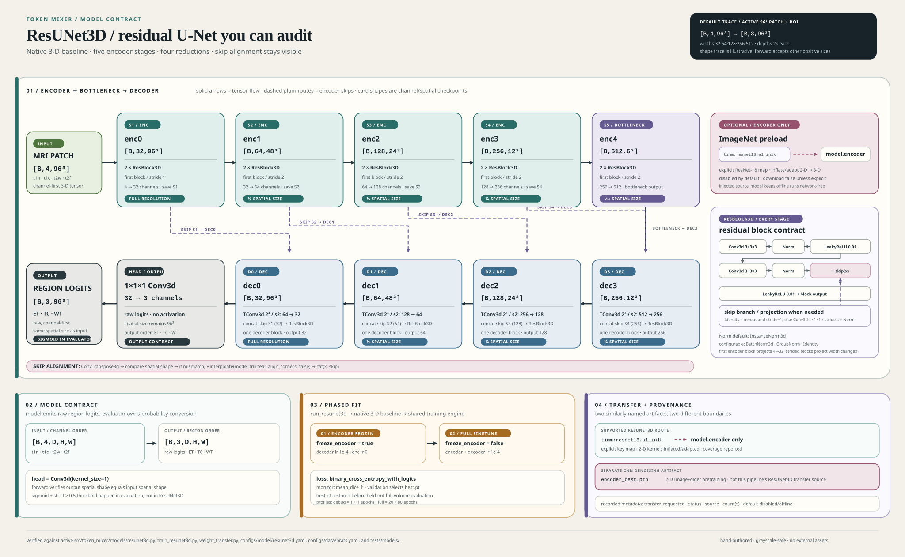

# ResUNet3D

ResUNet3D is the package's native 3-D residual U-Net segmentation baseline. It
consumes four-channel BraTS MRI volumes and emits three independent region
logits in `ET`, `TC`, `WT` order. The implementation is configurable, but the
canonical contract intentionally rejects other input and output channel counts.

This guide documents active behavior only. Source, composed configuration, and
tests take precedence over this prose. Shared data, training, evaluation, and
reproducibility contracts remain owned by [DATA.md](DATA.md),
[TRAINING.md](TRAINING.md), [EVALUATE.md](EVALUATE.md), and
[REPRODUCIBILITY.md](REPRODUCIBILITY.md).

## Architecture Diagram

 summarizes the
verified default tensor trace, skip routes, residual block, phased fit, and
optional transfer boundary described below.

## Quick Contract

| Item | Active contract |
| --- | --- |
| Input | `[B, 4, D, H, W]`; BraTS modalities are `t1n`, `t1c`, `t2w`, `t2f` |
| Output | Raw logits with shape `[B, 3, D, H, W]` |
| Region order | `ET`, `TC`, `WT` |
| Encoder levels | Five stages: `enc0` through `enc4` |
| Spatial reductions | Four stride-2 encoder transitions |
| Decoder levels | Four stages: `dec3` through `dec0` |
| Default widths | `(32, 64, 128, 256, 512)` |
| Default depths | `(2, 2, 2, 2, 2)` residual blocks per encoder stage |
| Default normalization | `InstanceNorm3d`, affine parameters enabled |
| Segmentation loss | `binary_cross_entropy_with_logits` |
| Selection metric | `mean_dice`, maximized |
| Transfer default | Disabled; no network access unless explicitly requested |

The model returns logits, not probabilities or masks. Inference converts those
logits with sigmoid and a strict probability threshold in
[`src/token_mixer/evaluation/metrics.py::logits_to_regions`](../src/token_mixer/evaluation/metrics.py#L21-L34).

## Source Map

Required architecture symbols:

- [`src/token_mixer/models/resunet3d.py::ResBlock3D`](../src/token_mixer/models/resunet3d.py#L213-L276)
- [`src/token_mixer/models/resunet3d.py::EncStage`](../src/token_mixer/models/resunet3d.py#L279-L319)
- [`src/token_mixer/models/resunet3d.py::DecStage`](../src/token_mixer/models/resunet3d.py#L322-L363)
- [`src/token_mixer/models/resunet3d.py::ResUNetEncoder`](../src/token_mixer/models/resunet3d.py#L366-L423)
- [`src/token_mixer/models/resunet3d.py::ResUNetDecoder`](../src/token_mixer/models/resunet3d.py#L426-L478)
- [`src/token_mixer/models/resunet3d.py::ResUNet3D`](../src/token_mixer/models/resunet3d.py#L542-L682)
- [`src/token_mixer/models/resunet3d.py::build_resunet3d`](../src/token_mixer/models/resunet3d.py#L685-L720)

Supporting runtime and evidence symbols:

- [`src/token_mixer/pipelines/train_resunet3d.py::run_resunet3d`](../src/token_mixer/pipelines/train_resunet3d.py#L286-L322)
- [`src/token_mixer/pipelines/train_resunet3d.py::_transfer_settings`](../src/token_mixer/pipelines/train_resunet3d.py#L82-L173)
- [`src/token_mixer/pipelines/train_resunet3d.py::_build_model`](../src/token_mixer/pipelines/train_resunet3d.py#L216-L249)
- [`src/token_mixer/models/weight_transfer.py::inflate_encoder_state_dict`](../src/token_mixer/models/weight_transfer.py#L54-L160)
- [`src/token_mixer/models/weight_transfer.py::transfer_resnet18_encoder_state_dict`](../src/token_mixer/models/weight_transfer.py#L643-L724)
- [`src/token_mixer/models/weight_transfer.py::load_imagenet_resnet18_weights`](../src/token_mixer/models/weight_transfer.py#L745-L791)
- [`src/token_mixer/pipelines/_baseline_common.py::build_loss`](../src/token_mixer/pipelines/_baseline_common.py#L799-L845)
- [`src/token_mixer/pipelines/_baseline_common.py::build_phases`](../src/token_mixer/pipelines/_baseline_common.py#L848-L914)
- [`src/token_mixer/pipelines/_baseline_common.py::run_3d_baseline`](../src/token_mixer/pipelines/_baseline_common.py#L1168-L1261)
- [`src/token_mixer/training/phases.py::PhaseSpec`](../src/token_mixer/training/phases.py#L9-L18)
- [`src/token_mixer/training/phases.py::apply_phase`](../src/token_mixer/training/phases.py#L20-L27)
- [`src/token_mixer/training/engine.py::fit`](../src/token_mixer/training/engine.py#L462-L791)
- [`src/token_mixer/training/artifacts.py::write_run_artifacts`](../src/token_mixer/training/artifacts.py#L101-L214)
- [`src/token_mixer/training/artifacts.py::write_failed_run_artifact`](../src/token_mixer/training/artifacts.py#L217-L284)
- [`src/token_mixer/cli.py::_run`](../src/token_mixer/cli.py#L68-L100)

Configuration and tests:

- [`configs/model/resunet3d.yaml`](../configs/model/resunet3d.yaml#L1-L16)
- [`configs/experiment/resunet3d.yaml`](../configs/experiment/resunet3d.yaml#L1-L37)
- [`configs/data/brats.yaml`](../configs/data/brats.yaml#L1-L22)
- [`configs/run/debug.yaml`](../configs/run/debug.yaml#L1-L17)
- [`configs/run/full.yaml`](../configs/run/full.yaml#L1-L17)
- [`tests/models/test_resunet3d.py`](../tests/models/test_resunet3d.py#L26-L118)
- [`tests/models/test_resunet_transfer.py`](../tests/models/test_resunet_transfer.py#L97-L180)
- [`tests/models/test_weight_transfer.py`](../tests/models/test_weight_transfer.py#L12-L205)
- [`tests/pipelines/test_train_resunet3d.py`](../tests/pipelines/test_train_resunet3d.py#L78-L231)
- [`tests/integration/test_synthetic_debug.py`](../tests/integration/test_synthetic_debug.py#L227-L285)

## Architecture

### Residual block

[`src/token_mixer/models/resunet3d.py::ResBlock3D`](../src/token_mixer/models/resunet3d.py#L213-L276)
has two `3x3x3` convolutions. The first convolution can stride by one or two;
the second always keeps spatial resolution. Both convolutions have no bias and
are followed by the configured normalization. A `LeakyReLU(0.01)` follows the
first normalized convolution and the residual addition.

The skip branch is `Identity` when input and output channels match and stride is
one. Otherwise it is a `1x1x1` convolution with the same stride followed by the
same normalization family. The forward operation is:

```text
hidden = LeakyReLU(norm1(conv1(x)))
hidden = norm2(conv2(hidden))
output = LeakyReLU(hidden + skip(x))
```

This projection is what lets a stage change width and spatial resolution while
retaining an additive residual path.

### Encoder stages

[`src/token_mixer/models/resunet3d.py::EncStage`](../src/token_mixer/models/resunet3d.py#L279-L319)
always creates at least one residual block. Its first block maps `in_ch` to
`out_ch`; it uses stride two when `downsample=True`. Remaining blocks map
`out_ch` to itself with stride one. Consequently, every encoder stage has one
possible transition followed by its configured residual depth.

[`src/token_mixer/models/resunet3d.py::ResUNetEncoder`](../src/token_mixer/models/resunet3d.py#L366-L423)
creates five stages from the width and depth tuples. Stage zero is full
resolution. Stages one through four downsample in their first residual block.
The encoder returns the final tensor as `bottleneck` and returns only the first
four stage outputs as skips. The skip list is ordered from highest spatial
resolution to lowest: `enc0`, `enc1`, `enc2`, `enc3`.

### Decoder stages

[`src/token_mixer/models/resunet3d.py::DecStage`](../src/token_mixer/models/resunet3d.py#L322-L363)
starts with a `ConvTranspose3d` using `kernel_size=2` and `stride=2`. It then
concatenates the upsampled tensor with one encoder skip along the channel axis
and runs one residual block. If transpose-convolution output does not exactly
match the skip's spatial shape, it uses trilinear interpolation with
`align_corners=False` before concatenation.

[`src/token_mixer/models/resunet3d.py::ResUNetDecoder`](../src/token_mixer/models/resunet3d.py#L426-L478)
requires exactly four skips ordered full-resolution first. It consumes them in
reverse resolution order: `dec3` with `enc3`, then `dec2` with `enc2`, `dec1`
with `enc1`, and `dec0` with `enc0`.

### Verified channel and spatial path

The active BraTS data group sets `patch_size` and `roi_size` to `[96, 96, 96]`.
With the active model defaults, the even-sized path is:

| Tensor | Input channels | Output channels | Blocks | Spatial size for a `96^3` patch | Transition |
| --- | ---: | ---: | ---: | ---: | --- |
| `enc0` | 4 | 32 | 2 | `96^3` | No downsample |
| `enc1` | 32 | 64 | 2 | `48^3` | First block stride 2 |
| `enc2` | 64 | 128 | 2 | `24^3` | First block stride 2 |
| `enc3` | 128 | 256 | 2 | `12^3` | First block stride 2 |
| `enc4` bottleneck | 256 | 512 | 2 | `6^3` | First block stride 2 |
| `dec3` | 512 + 256 skip | 256 | 1 residual block | `12^3` | Transpose convolution, then align |
| `dec2` | 256 + 128 skip | 128 | 1 residual block | `24^3` | Transpose convolution, then align |
| `dec1` | 128 + 64 skip | 64 | 1 residual block | `48^3` | Transpose convolution, then align |
| `dec0` | 64 + 32 skip | 32 | 1 residual block | `96^3` | Transpose convolution, then align |
| `head` | 32 | 3 | 1x1x1 convolution | `96^3` | Raw region logits |

The table is a verified active configuration path, not a claim that every
input must be `96^3`. `ResUNet3D` validates positive input spatial dimensions
and checks that the final logits preserve the input spatial shape. The
`spatial_size` setting is validated and retained in model configuration; it is
not an input resize operation or a separate runtime divisibility assertion.
For odd or otherwise mismatched intermediate dimensions, decoder interpolation
aligns each upsampled tensor to its skip before concatenation.

The public `spatial_divisor` class attribute is `2**4 = 16`, reflecting four
encoder reductions. The runtime shape check, rather than this attribute, is the
final output-shape guard.

### Output head and region semantics

[`src/token_mixer/models/resunet3d.py::ResUNet3D`](../src/token_mixer/models/resunet3d.py#L542-L682)
constructs `head` as `Conv3d(widths[0], out_channels, kernel_size=1)`. There is
no sigmoid or softmax in the model. `output_regions` is the canonical tuple
`("ET", "TC", "WT")`, supplied by
[`src/token_mixer/data/labels.py::REGION_NAMES`](../src/token_mixer/data/labels.py#L6-L6).

`forward` rejects non-5-D input and channel counts other than four, then raises
if the final tensor is not exactly `[B, 3, D, H, W]` for the input's spatial
dimensions. The segmentation channels are independent binary-region logits,
not mutually exclusive class logits. The data label conversion defines `ET` as
the enhancing-tumor mask, `TC` as label one plus `ET`, and `WT` as all positive
labels in [`src/token_mixer/data/labels.py::to_region_masks`](../src/token_mixer/data/labels.py#L36-L47).

Decoder and head convolution weights receive Kaiming-normal initialization in
`ResUNet3D`; encoder modules use their normal PyTorch module initialization.

## Configuration

### Active defaults

[`configs/model/resunet3d.yaml`](../configs/model/resunet3d.yaml#L1-L16) sets:

```yaml
architecture: ResUNet3D
in_channels: 4
out_channels: 3
base_features: 32
depths: [2, 2, 2, 2, 2]
normalization: instance
norm_num_groups: null
norm_affine: true
```

`build_resunet3d` accepts a nested model config or a flat config. The model
config resolver supports these active aliases: `base_features`,
`base_channels`, or `feature_size`; `widths` or `channels`; `depths`;
`normalization`, `norm_name`, or `norm`; and `norm_num_groups` or
`num_groups`.

### Widths and depths

`base_features` must be a positive integer. If `widths` is omitted, the builder
generates exactly five widths as `base_features * 2**stage_index`, giving the
default `(32, 64, 128, 256, 512)`. Explicit widths must contain exactly five
positive integers. `depths` must also contain exactly five positive integers;
each entry controls the number of residual blocks in its encoder stage. Tests
cover custom widths, depths, and rejection of zero or incorrectly sized tuples
in [`tests/models/test_resunet3d.py::test_resunet3d_uses_configured_widths_depths_and_normalization`](../tests/models/test_resunet3d.py#L38-L55)
and [`tests/models/test_resunet3d.py::test_resunet3d_rejects_invalid_model_configuration`](../tests/models/test_resunet3d.py#L95-L109).

The canonical channel guard still applies when widths and depths are customized:
`in_channels` must remain four and `out_channels` must remain three.

### Normalization

The normalization resolver accepts `instance`, `batch`, `group`, and
`identity`, plus common spelling aliases such as `InstanceNorm3d`,
`BatchNorm3d`, and `GroupNorm`. The configured choice is used in residual main
paths and projection skips.

- `instance` creates `InstanceNorm3d(channels, affine=norm_affine)`.
- `batch` creates `BatchNorm3d(channels, affine=norm_affine)`.
- `group` creates `GroupNorm(groups, channels, affine=norm_affine)`.
- `identity` creates no-op normalization.

For group normalization, an explicit `norm_num_groups` must divide every
encoder and decoder channel count. When omitted, the resolver chooses the
largest divisor no greater than eight. The active model uses instance
normalization, so `norm_num_groups: null` is expected. Group normalization is
used by tiny CPU contract fixtures because it is valid at small batch sizes.

`norm_affine` is converted to a boolean and is not included in the model's
public width/depth contract. The `spatial_size` resolver accepts an integer or
three-value positive sequence and can read `spatial_size`, `patch_size`,
`roi_size`, or `volume_size` from the model, data, dataset, or run sections.
The composed BraTS data group supplies the active `[96, 96, 96]` value through
`patch_size`.

## Training Flow

The `resunet3d` experiment dispatches to
[`src/token_mixer/pipelines/train_resunet3d.py::run_resunet3d`](../src/token_mixer/pipelines/train_resunet3d.py#L286-L322).
The native 3-D baseline path then:

1. Resolves device, explicit spacing, seed, and deterministic execution.
2. Builds the model, including optional encoder transfer, before fitting.
3. Builds manifest-backed patch-training and full-volume validation/test loaders.
4. Creates the evaluator, loss, phase list, tracker, and required checkpoint manager.
5. Calls the shared [`src/token_mixer/training/engine.py::fit`](../src/token_mixer/training/engine.py#L462-L791).
6. Restores `checkpoints/best.pt` and evaluates the held-out test volume loader.
7. Returns a `FitResult` enriched with test metrics and pipeline metadata.

Training uses `BratsPatchDataset` for train patches and `BratsVolumeDataset` for
validation and test volumes. Full-volume evaluation uses MONAI sliding-window
inference; the evaluation protocol and explicit spacing rules are owned by
[EVALUATE.md](EVALUATE.md).

### Freeze and unfreeze phases

[`configs/experiment/resunet3d.yaml`](../configs/experiment/resunet3d.yaml#L9-L37)
defines two phases:

| Phase | Epochs | Encoder state | Encoder LR | Decoder LR |
| --- | --- | --- | ---: | ---: |
| `encoder_frozen` | `${run.phase1_epochs}` | Frozen | `0.0` | `1.0e-4` |
| `full_finetune` | `${run.phase2_epochs}` | Trainable | `1.0e-4` | `1.0e-4` |

[`src/token_mixer/training/phases.py::apply_phase`](../src/token_mixer/training/phases.py#L20-L27)
sets `requires_grad` only on parameters below the model's public `encoder`
module. The engine rebuilds optimizer parameter groups at each phase boundary;
only parameters with `requires_grad=True` enter a group. During a fully frozen
encoder phase, the engine also keeps the encoder in evaluation mode so
stateful normalization layers do not update running state.

`ResUNet3D` exposes equivalent direct helpers,
[`src/token_mixer/models/resunet3d.py::ResUNet3D.freeze_encoder`](../src/token_mixer/models/resunet3d.py#L648-L657)
and [`src/token_mixer/models/resunet3d.py::ResUNet3D.unfreeze_encoder`](../src/token_mixer/models/resunet3d.py#L658-L660).
The configured pipeline uses `PhaseSpec` and `apply_phase`, not those helpers
directly. `encoder_params()` returns the encoder parameter list;
`decoder_params()` returns decoder plus head parameters for the shared grouping
seam.

The shipped profiles interpolate phase lengths from
[`configs/run/debug.yaml`](../configs/run/debug.yaml#L1-L17) and
[`configs/run/full.yaml`](../configs/run/full.yaml#L1-L17):

- `debug`: `max_cases: 2` per split, one epoch frozen plus one epoch full fine-tuning, batch size one, no AMP.
- `full`: all cases, 20 frozen epochs plus 80 full fine-tuning epochs, batch size two, eight workers, and AMP enabled.

These are configured run plans, not evidence that either run has completed.
The `run.epochs` value is used by the separate CNN pretraining experiment; the
ResUNet3D phase plan uses `phase1_epochs` and `phase2_epochs`.

### Loss, logits, and monitor

The experiment selects `binary_cross_entropy_with_logits`. The shared builder
returns `F.binary_cross_entropy_with_logits(logits, target.float())`, so raw
model logits go directly into the loss and targets are cast to float. Applying
sigmoid before this loss would change the intended numerical contract.

At validation, the full-volume evaluator applies sigmoid and strict `> 0.5`
thresholding to produce region masks, then computes per-region Dice and
spacing-aware HD95. The experiment declares both `checkpoint_metric: mean_dice`
and `monitor: mean_dice`; the operative engine selection key is `monitor`, with
`maximize: true`. A finite validation value replaces the best value only when it
improves in the configured direction. The final configured epoch is validated
even when it does not land on the validation interval.

The active optimizer is AdamW with weight decay `1.0e-4`. The scheduler is
cosine with epoch interval. The debug profile validates every epoch; the full
profile sets validation interval five. History rows contain train loss, phase
bookkeeping, learning rates, global step, and validation metrics when validation
runs.

### Checkpoints and run artifacts

The 3-D baseline requires checkpointing. The engine writes `best.pt` when a
validation monitor improves, `last.pt` after each completed epoch, and a
phase-specific resume checkpoint at each phase boundary. The baseline restores
`best.pt` before held-out test evaluation.

The CLI writes the composed `config.yaml` before dispatch. After a successful
`FitResult`, [`src/token_mixer/training/artifacts.py::write_run_artifacts`](../src/token_mixer/training/artifacts.py#L101-L214)
writes:

- `metrics.json` with best epoch, best monitor value, full history, and numeric test metrics.
- `provenance.json` with experiment, architecture, model config, seed, device, manifest hash, monitor, direction, source checkpoint, runtime, tracking config, and pipeline metadata.

This path is separate from exact resume and warm start. Use [TRAINING.md](TRAINING.md)
for checkpoint compatibility, RNG restoration, and model-only warm-start
semantics.

## ImageNet Transfer

### Active flags

The model group disables transfer by default:

```yaml
imagenet_transfer:
  enabled: false
  download: false
  cache_dir: null
  source: null
```

The exact active keys are:

| Key | Meaning |
| --- | --- |
| `model.imagenet_transfer.enabled` | Request the transfer path. |
| `model.imagenet_transfer.download` | Permit lazy creation of a pretrained timm source model. Default false prevents network access. |
| `model.imagenet_transfer.cache_dir` | Optional cache directory forwarded to timm model creation. |
| `model.imagenet_transfer.source` | Provenance label only; it does not load a file or inject a source model. |

For CLI timm loading, set both `enabled=true` and `download=true`. Setting only
`download=true` does not override an explicit `enabled=false`. An offline,
network-free test or controlled caller can pass `source_model` to
`run_resunet3d`; the source may be an `nn.Module` or a tensor mapping. With
`download=false`, this injected path avoids lazy timm creation. The pipeline
forwards that object to
[`src/token_mixer/models/weight_transfer.py::load_imagenet_resnet18_weights`](../src/token_mixer/models/weight_transfer.py#L745-L791)
and uses `download` only to control lazy timm creation when no source object is
provided.

### timm ResNet-18 path

The pretrained source identifier is `resnet18.a1_in1k`, recorded by
`TIMM_RESNET18_NAME`. With download enabled, the helper lazily calls
`timm.create_model` with `pretrained=True` and `num_classes=0`. The optional
`research` extra supplies timm; no import or network request occurs on the
default disabled path.

[`src/token_mixer/models/weight_transfer.py::transfer_resnet18_encoder_state_dict`](../src/token_mixer/models/weight_transfer.py#L643-L724)
uses an explicit ResNet-18 key map into `model.encoder`, not a whole-model
state-dictionary load. It transfers the recognized stem, normalization, and
ResNet block entries. Supported shape handling is deliberate:

- Compatible tensors copy directly as detached clones.
- 2-D convolution kernels inflate to 3-D by repeating the depth plane and dividing by target depth.
- The RGB `7x7` stem adapts output channels, maps three source input channels to four MRI channels with a deterministic mean channel, center-crops spatial kernels, and repeats through target depth.
- Stem normalization vectors can be adapted to target length.
- Depthwise and standard convolution semantics are not silently interchanged.
- Missing or incompatible keys are warned and counted; arbitrary reshapes are refused.

The critical 3-D stem must transfer, and total copied coverage must be at least
50 percent. Returned counts include `direct`, `inflated`, `adapted`, `copied`,
`skipped`, `total`, `coverage`, `missing_source`, `incompatible`, and
`unmapped`. Tests verify block mapping, kernel inflation, RGB-to-MRI stem
adaptation, coverage, lazy timm creation, and refusal to download implicitly in
[`tests/models/test_resunet_transfer.py`](../tests/models/test_resunet_transfer.py#L97-L180).

### CNN `encoder_best.pth` is a different artifact

`encoder_best.pth` comes from the separate 2-D ImageFolder denoising pipeline,
[`src/token_mixer/pipelines/pretrain_cnn.py::run_cnn_denoising_pretrain`](../src/token_mixer/pipelines/pretrain_cnn.py#L755-L859).
That pipeline trains a [`src/token_mixer/models/cnn_pretrain.py::PretrainCNNEncoder`](../src/token_mixer/models/cnn_pretrain.py#L266-L341)
inside a 2-D denoising autoencoder, restores its best checkpoint, and exports a
payload containing:

```text
encoder_state_dict
source_model_config
epoch
val_loss
```

Its default source model is a four-level, three-channel 2-D CNN with LayerNorm,
convolutional blocks, and MLP refinement. It is not timm ResNet-18 and it is not
an ImageNet classification checkpoint. Its denoising objective monitors MSE,
which is unrelated to ResUNet3D's segmentation `mean_dice` monitor.

The packaged ResUNet3D pipeline does not read `encoder_best.pth` and has no
configuration flag that makes it do so. Its transfer boundary calls the timm
ResNet-18 helper above. The generic
[`src/token_mixer/models/weight_transfer.py::inflate_encoder_state_dict`](../src/token_mixer/models/weight_transfer.py#L54-L160)
can perform explicitly supported name, shape, and 2-D-to-3-D adaptations for a
caller-provided state mapping, but that helper is not an automatic
`encoder_best.pth` loader and does not make the two encoder architectures
equivalent. An `encoder_best.pth` file's presence must never be reported as
evidence that timm ResNet-18 weights were used.

### Transfer provenance and failures

`_transfer_settings` records the effective request, download permission, cache
directory, source label, and injected source object. If no source label is
configured, the effective source is `injected` for an injected source model or
`timm:resnet18.a1_in1k` for a requested timm load. A configured string in
`source` is preserved as metadata only.

On success, the pipeline records `transfer_requested`, `transfer_status` set to
`loaded`, `transfer_count`, `transfer_counts`, and `transfer_source` in result
metadata, under both `weight_transfer` and `imagenet_transfer`. The transfer
count is required to be positive.

If requested transfer cannot load, `_build_model` marks the report as failed,
attaches it to the raised error, and fails before `fit`. The CLI catches this
specific report and writes failure-only `provenance.json` through
[`src/token_mixer/training/artifacts.py::write_failed_run_artifact`](../src/token_mixer/training/artifacts.py#L217-L284).
That artifact records the error and transfer context but does not fabricate
`metrics.json`, best metrics, or training history. The pipeline tests protect
the no-training failure boundary and metadata persistence in
[`tests/pipelines/test_train_resunet3d.py`](../tests/pipelines/test_train_resunet3d.py#L78-L231).

## Verification Evidence

The nearest contract tests are:

- `tests/models/test_resunet3d.py` checks canonical forward shape, region order, custom widths/depths, normalization selection, public encoder transfer, parameter groups, finite CPU backward, invalid configuration, and rank/channel failures.
- `tests/models/test_resunet_transfer.py` checks the explicit timm ResNet-18 map, stem adaptation, coverage, disabled implicit download, and lazy download forwarding.
- `tests/models/test_weight_transfer.py` checks generic direct copies, aliases, depth inflation, MRI stem adaptation, depthwise mismatch refusal, stable warnings, critical-stem guards, and the 50 percent coverage guard.
- `tests/pipelines/test_train_resunet3d.py` checks injected transfer invocation, transfer metadata in artifacts, failure before training, failure provenance, and preservation of the original transfer error.
- `tests/integration/test_synthetic_debug.py` exercises a small synthetic four-case path through model forward, BCE-with-logits loss, backward, injected transfer, checkpoint creation, full-volume evaluation, and provenance.

These tests are contract evidence, not quality results. They use tiny tensors,
synthetic state dictionaries, monkeypatched loaders or fit functions, fake timm
creation, temporary directories, and optional synthetic NIfTI fixtures. They do
not validate pretrained weights from the network, a real `encoder_best.pth`
artifact from a completed CNN run, or a production BraTS training run.

## Safe Preflight and Limits

Composition-only inspection is safe and does not dispatch training:

```bash
uv run python -m token_mixer --config-name local experiment=resunet3d run=debug --cfg job
```

It verifies Hydra composition output only. A real local debug command still
needs prepared BraTS cases, a matching split manifest, imaging dependencies, and
available checkpoint storage. Full/cloud execution is expensive and requires
explicit approval; the full profile's 20-plus-80 phase plan is intent, not a
completed result.

No real-data, full-dataset, GPU, W&B, or timm-network run is claimed by this
guide. Passing focused or full tests cannot establish convergence, Dice/HD95
quality, generalization, model ranking, GPU behavior, multi-worker behavior, or
exact reproduction of the cited nnU-Net-style provenance. Report a real result
only with its resolved configuration, manifest identity, code version, device,
phase plan, monitor direction, transfer source and counts, and saved run
artifacts.

## Provenance

The active model module describes this implementation as a configurable
nnU-Net-style residual path and cites Isensee et al., *nnU-Net: Self-adapting
Framework for U-Net-Based Medical Image Segmentation*, arXiv:1809.10486, with
the [nnU-Net reference implementation](https://github.com/MIC-DKFZ/nnUNet).
The weight-transfer module cites He et al., *Deep Residual Learning for Image
Recognition*, arXiv:1512.03385, and the [official timm implementation](https://github.com/huggingface/pytorch-image-models).

Those references explain implementation provenance. This repository's active
tests and configs do not support a claim of exact paper architecture, exact
pretrained-weight reproduction, or reported paper metrics.
