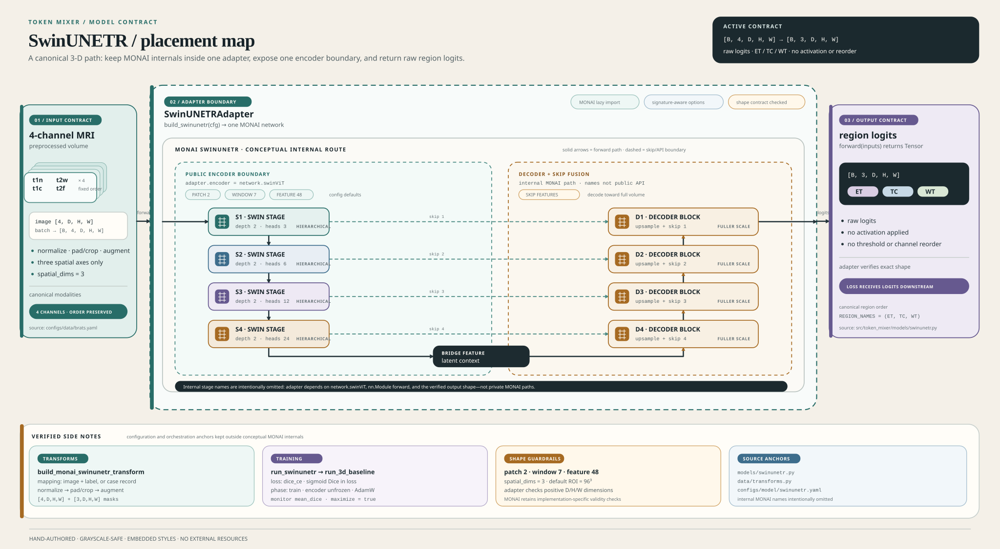

# SwinUNETR



SwinUNETR is the active native 3-D baseline selected by `experiment=swinunetr`.
The repository does not reimplement SwinUNETR. It wraps MONAI's network behind a
small adapter that enforces the project's BraTS tensor contract, exposes one
transformer encoder boundary to the shared training engine, and returns raw
region logits.

This guide documents the active repository path and the MONAI boundary. Local
Python source, active YAML, and tests are authoritative when this guide drifts.
The MONAI stage geometry below is checked against the MONAI 1.6.0 source in the
current lock and environment; internal MONAI names are not a stable repository
API.

## Source Map

Primary repository references:

- [`src/token_mixer/models/swinunetr.py::SwinUNETRAdapter`](../src/token_mixer/models/swinunetr.py#L239-L289)
- [`src/token_mixer/models/swinunetr.py::build_swinunetr`](../src/token_mixer/models/swinunetr.py#L292-L406)
- [`src/token_mixer/models/swinunetr.py::_config_entry`](../src/token_mixer/models/swinunetr.py#L41-L58)
- [`src/token_mixer/models/swinunetr.py::_aliased_config_value`](../src/token_mixer/models/swinunetr.py#L109-L123)
- [`src/token_mixer/models/swinunetr.py::_supported_kwargs`](../src/token_mixer/models/swinunetr.py#L170-L236)
- [`src/token_mixer/models/swinunetr.py::_load_swinunetr`](../src/token_mixer/models/swinunetr.py#L159-L167)
- [`src/token_mixer/data/transforms.py::preprocess_volume`](../src/token_mixer/data/transforms.py#L227-L269)
- [`src/token_mixer/data/transforms.py::build_monai_swinunetr_transform`](../src/token_mixer/data/transforms.py#L311-L345)
- [`src/token_mixer/pipelines/train_swinunetr.py::run_swinunetr`](../src/token_mixer/pipelines/train_swinunetr.py#L25-L59)
- [`src/token_mixer/pipelines/_baseline_common.py::build_volume_loaders`](../src/token_mixer/pipelines/_baseline_common.py#L410-L447)
- [`src/token_mixer/pipelines/_baseline_common.py::build_volume_evaluator`](../src/token_mixer/pipelines/_baseline_common.py#L657-L691)
- [`src/token_mixer/pipelines/_baseline_common.py::build_loss`](../src/token_mixer/pipelines/_baseline_common.py#L799-L845)
- [`src/token_mixer/pipelines/_baseline_common.py::build_phases`](../src/token_mixer/pipelines/_baseline_common.py#L848-L914)
- [`src/token_mixer/pipelines/_baseline_common.py::run_3d_baseline`](../src/token_mixer/pipelines/_baseline_common.py#L1168-L1261)
- [`src/token_mixer/cli.py::_dispatch`](../src/token_mixer/cli.py#L39-L65)
- [`src/token_mixer/evaluation/inference.py::evaluate_full_volumes`](../src/token_mixer/evaluation/inference.py#L188-L288)
- [`src/token_mixer/evaluation/metrics.py::logits_to_regions`](../src/token_mixer/evaluation/metrics.py#L21-L34)
- [`src/token_mixer/training/phases.py::{PhaseSpec,apply_phase}`](../src/token_mixer/training/phases.py#L9-L27)
- [`src/token_mixer/training/engine.py::_parameter_groups`](../src/token_mixer/training/engine.py#L173-L198)
- [`src/token_mixer/training/engine.py::fit`](../src/token_mixer/training/engine.py#L462-L789)
- [`src/token_mixer/training/tracking.py::create_tracker`](../src/token_mixer/training/tracking.py#L49-L81)
- [`src/token_mixer/training/artifacts.py::write_run_artifacts`](../src/token_mixer/training/artifacts.py#L101-L214)

Configuration and contract tests:

- [`configs/model/swinunetr.yaml::model defaults`](../configs/model/swinunetr.yaml#L1-L15)
- [`configs/experiment/swinunetr.yaml::training`](../configs/experiment/swinunetr.yaml#L6-L32)
- [`configs/data/brats.yaml::BraTS defaults`](../configs/data/brats.yaml#L1-L22)
- [`configs/run/debug.yaml::debug defaults`](../configs/run/debug.yaml#L1-L17)
- [`configs/run/full.yaml::full defaults`](../configs/run/full.yaml#L1-L17)
- [`tests/models/test_swinunetr.py::test_module_import_does_not_load_monai`](../tests/models/test_swinunetr.py#L30-L51)
- [`tests/models/test_swinunetr.py::test_builder_reads_nested_config_and_maps_drop_to_monai`](../tests/models/test_swinunetr.py#L54-L91)
- [`tests/models/test_swinunetr.py::test_builder_exposes_unique_encoder_boundary_for_shared_parameter_groups`](../tests/models/test_swinunetr.py#L117-L134)
- [`tests/models/test_swinunetr.py::test_wrapper_validates_input_rank_and_channels`](../tests/models/test_swinunetr.py#L245-L253)
- [`tests/models/test_swinunetr.py::test_builder_reports_optional_monai_dependency`](../tests/models/test_swinunetr.py#L357-L368)
- [`tests/models/test_swinunetr.py::test_monai_cpu_forward_preserves_brat_logits_shape`](../tests/models/test_swinunetr.py#L371-L395)
- [`tests/models/test_baseline_shapes.py::test_swinunetr_cpu_forward_preserves_canonical_shape_when_imaging_deps_exist`](../tests/models/test_baseline_shapes.py#L35-L57)
- [`tests/data/test_datasets.py::test_monai_adapter_is_optional`](../tests/data/test_datasets.py#L213-L216)
- [`tests/test_cli_config.py::test_experiment_groups_select_model_and_data`](../tests/test_cli_config.py#L54-L72)
- [`tests/test_cli_config.py::test_dispatches_experiment_to_pipeline_without_constructing_models`](../tests/test_cli_config.py#L96-L132)

External architecture references:

- [SwinUNETR paper](https://arxiv.org/abs/2201.01266)
- [MONAI 1.6.0 SwinUNETR implementation](https://github.com/Project-MONAI/MONAI/blob/1.6.0/monai/networks/nets/swin_unetr.py)
- [Project MONAI SwinUNETR research page](https://monai.io/research/swin-unetr)

## Runtime Path

The supported path is:

```text
experiment=swinunetr
  -> src/token_mixer/cli.py::_dispatch
  -> src/token_mixer/pipelines/train_swinunetr.py::run_swinunetr
  -> src/token_mixer/pipelines/_baseline_common.py::run_3d_baseline
  -> build_swinunetr(cfg)
  -> SwinUNETRAdapter(network)
  -> patch-training / full-volume validation and test
  -> MONAI sliding-window evaluation
  -> raw logits, then shared metric conversion
```

`src/token_mixer/cli.py::_dispatch` imports the SwinUNETR pipeline only for the
matching selector. The pipeline supplies the model builder, shared volume loader,
volume evaluator, loss, phase, checkpoint, tracker, seed, and fit seams to
`src/token_mixer/pipelines/_baseline_common.py::run_3d_baseline`. The shared
engine does not need to know MONAI's class name beyond pipeline metadata.

SwinUNETR is a 3-D path, not the 2-D slice protocol used by TransUNet. Training
uses patches; validation and test use complete processed volumes and batch size
one. The full-volume evaluator applies MONAI sliding-window inference before
converting logits to region masks. See [DATA.md](DATA.md),
[TRAINING.md](TRAINING.md), and [EVALUATE.md](EVALUATE.md) for cross-cutting
contracts.

## Adapter Contract

### `SwinUNETRAdapter`

`src/token_mixer/models/swinunetr.py::SwinUNETRAdapter` wraps exactly one
MONAI-created `nn.Module`. Construction fails unless the object is an
`nn.Module` and exposes its transformer encoder as `swinViT`.

The adapter publishes these fixed values:

| Property | Value | Meaning |
| --- | --- | --- |
| `in_channels` | `4` | Four BraTS MRI modalities |
| `out_channels` | `3` | Three region-logit channels |
| `num_classes` | `3` | Alias for the canonical output count |
| `spatial_dims` | `3` | Native volumetric path |
| `output_regions` | `("ET", "TC", "WT")` | Fixed channel order from `REGION_NAMES` |

The `encoder` property returns `network.swinViT` without assigning it to a
second module attribute. This avoids a duplicate registration path and gives the
shared engine one identity-stable boundary for parameter grouping. The contract
is tested by checking that named parameters are unique and that encoder and
non-encoder optimizer groups are disjoint. The exposed boundary is the
transformer `swinViT` module only; MONAI's auxiliary `encoder1`, `encoder2`,
`encoder3`, `encoder4`, and `encoder10` modules remain other parameters from the
adapter's point of view.

### `forward`

The adapter validates before calling MONAI:

1. Input must be a `torch.Tensor`.
2. Input must have five dimensions in `[B, C, D, H, W]` order.
3. `C` must equal `4`.
4. Every spatial dimension must be positive.

It then calls the wrapped network and requires a tensor with exactly
`[B, 3, D, H, W]`, preserving the input batch and spatial sizes. A non-tensor
result or any shape mismatch raises instead of silently reshaping or interpolating.
The returned values are raw logits in `[ET, TC, WT]` order. The adapter does not
apply sigmoid, thresholding, or channel reordering. `logits_to_regions` applies
sigmoid and thresholding later at the evaluation boundary.

## Builder Behavior

`src/token_mixer/models/swinunetr.py::build_swinunetr` accepts an OmegaConf
`DictConfig` or mapping. For each supported setting, `model.<key>` takes
precedence over a root-level `<key>` value. The builder validates the project's
fixed input/output contract before importing MONAI.

### Active model settings

The active [`configs/model/swinunetr.yaml`](../configs/model/swinunetr.yaml)
selects:

| Setting | Active value | Builder or MONAI boundary |
| --- | ---: | --- |
| `in_channels` | `4` | Must be exactly `4` |
| `out_channels` | `3` | Must be exactly `3` |
| `feature_size` | `48` | Positive integer; MONAI requires divisibility by `12` |
| `spatial_dims` | `3` | Must be exactly `3` |
| `patch_size` | `2` | Positive token patch size |
| `depths` | `[2, 2, 2, 2]` | Four positive stage depths |
| `num_heads` | `[3, 6, 12, 24]` | Four positive stage head counts |
| `window_size` | `7` | Positive scalar or three-value spatial sequence |
| `use_checkpoint` | `true` | MONAI gradient checkpointing option |
| `use_v2` | `false` | Keeps MONAI's v1 stage path |
| `drop_rate` | `0.0` | Dropout rate in `[0, 1]` |
| `attn_drop_rate` | `0.0` | Attention dropout rate in `[0, 1]` |
| `dropout_path_rate` | `0.0` | Drop-path rate in `[0, 1]` |

The builder defaults match the active model settings for omitted optional
constructor arguments: feature size `48`, spatial dimensions `3`, patch size
`2`, depths `(2, 2, 2, 2)`, heads `(3, 6, 12, 24)`, window `7`, checkpointing
enabled, v2 disabled, and zero rates. The MONAI constructor's own default
feature size is not the repository default because the builder explicitly uses
`48`.

### Aliases and signature compatibility

Two pairs are accepted for compatibility with existing configuration styles:

| Canonical key | Alias | Effective MONAI key | Default |
| --- | --- | --- | --- |
| `use_checkpoint` | `checkpoint` | `use_checkpoint` | `true` |
| `drop_rate` | `drop` | `drop_rate` | `0.0` |

Configure only one member of an alias pair. Supplying both raises `ValueError`
before the MONAI constructor runs. Explicitly configured optional settings are
validated, then forwarded through `_supported_kwargs`. That helper inspects the
installed constructor signature, omits unsupported options for older MONAI
versions when they were not explicitly configured, and raises `TypeError` when
an explicit option cannot be supported. This keeps optional compatibility from
silently discarding a requested architecture change.

Legacy MONAI constructors may accept `img_size`. The builder resolves a legacy
size from `img_size`, then `roi_size`, then `spatial_size`, defaulting to
`(96, 96, 96)`, and passes it only when the installed signature accepts
`img_size`. The current MONAI 1.6.0 signature does not expose `img_size`. The
active `data.patch_size` and `data.roi_size` values belong to data preprocessing
and loader configuration, not the model constructor. When no explicit
inference/evaluation ROI is configured, `build_volume_evaluator` currently falls
back to `data.patch_size`, not `data.roi_size`. Do not confuse either data
setting with model `patch_size=2`.

## MONAI Architecture Boundary

The local adapter calls the official MONAI `SwinUNETR` implementation, which is
based on the SwinUNETR paper. The following geometry is a documentation view of
the current MONAI 1.6.0 implementation, not a set of private module names that
local callers should depend on.

Let `F = feature_size` and assume the default `patch_size=2`. The transformer
encoder first projects the input through patch embedding and then runs four
hierarchical Swin stages. Each stage uses its configured depth and head count,
then patch merging halves each spatial axis and doubles the channel width.

| MONAI returned feature | Role in `SwinUNETR.forward` | Shape for input `[B, 4, D, H, W]` |
| --- | --- | --- |
| `hidden_states_out[0]` | First-resolution transformer skip source | `[B, F, D/2, H/2, W/2]` |
| `hidden_states_out[1]` | Second-resolution transformer skip source | `[B, 2F, D/4, H/4, W/4]` |
| `hidden_states_out[2]` | Third-resolution transformer skip source | `[B, 4F, D/8, H/8, W/8]` |
| `hidden_states_out[3]` | Fourth-resolution decoder skip | `[B, 8F, D/16, H/16, W/16]` |
| `hidden_states_out[4]` | Bottleneck input | `[B, 16F, D/32, H/32, W/32]` |

The four stage settings are therefore:

| Stage | Width | Depth | Heads |
| --- | ---: | ---: | ---: |
| Swin stage 1 | `F` | `2` | `3` |
| Swin stage 2 | `2F` | `2` | `6` |
| Swin stage 3 | `4F` | `2` | `12` |
| Swin stage 4 | `8F` | `2` | `24` |

Within each stage, MONAI alternates non-shifted and shifted local-window
self-attention blocks. Window partitioning may pad a feature map to a window
multiple and removes that temporary padding afterward. The paper describes the
hierarchical encoder as producing five resolutions; the table names those five
returned feature tensors without claiming them as adapter API.

### Decoder and skips

MONAI's `forward` combines the transformer features with convolutional UNETR
blocks and five resolution-aligned skip inputs:

| Local forward value | Operation | Shape for default geometry |
| --- | --- | --- |
| `enc0` | `encoder1(x_in)` | `[B, F, D, H, W]` |
| `enc1` | `encoder2(hidden_states_out[0])` | `[B, F, D/2, H/2, W/2]` |
| `enc2` | `encoder3(hidden_states_out[1])` | `[B, 2F, D/4, H/4, W/4]` |
| `enc3` | `encoder4(hidden_states_out[2])` | `[B, 4F, D/8, H/8, W/8]` |
| `dec4` | `encoder10(hidden_states_out[4])` | `[B, 16F, D/32, H/32, W/32]` |
| `dec3` | `decoder5(dec4, hidden_states_out[3])` | `[B, 8F, D/16, H/16, W/16]` |
| `dec2` | `decoder4(dec3, enc3)` | `[B, 4F, D/8, H/8, W/8]` |
| `dec1` | `decoder3(dec2, enc2)` | `[B, 2F, D/4, H/4, W/4]` |
| `dec0` | `decoder2(dec1, enc1)` | `[B, F, D/2, H/2, W/2]` |
| `out` | `decoder1(dec0, enc0)` | `[B, F, D, H, W]` |
| `logits` | `UnetOutBlock(out)` | `[B, 3, D, H, W]` |

The local `SwinUNETRAdapter.encoder` boundary deliberately exposes only
`network.swinViT`, even though MONAI uses names beginning with `encoder` for
several convolutional skip-processing blocks. The shared phase engine uses the
published property rather than guessing from MONAI's private module names.

## Shape And Window Constraints

There are two different spatial-size settings:

- Model `patch_size` is the Swin token patch. With `patch_size=2`, MONAI
  requires every input spatial dimension to be divisible by `2**5 = 32`.
- Data `patch_size` controls preprocessing crops and is the evaluator's fallback
  ROI when no explicit inference/evaluation ROI is configured. `roi_size` is an
  alternate preprocessing size key; the active values for both are
  `[96, 96, 96]`, which satisfy the model constraint.

`SwinUNETRAdapter` checks rank, channel count, and positive dimensions. MONAI's
`SwinUNETR._check_input_size` performs the additional divisibility check during
forward: every spatial dimension must be divisible by `patch_size**5`. For a
custom token patch `p`, use dimensions divisible by `p**5`. The adapter does not
pad, crop, or relax this model-level rule.

`window_size` accepts one positive integer or a positive three-value sequence.
MONAI expands a scalar to all three axes. At each stage, if a feature dimension
is no larger than its requested window, MONAI uses that dimension as the
effective window and disables shifting on that axis. Otherwise it pads the
feature map to a window multiple for partitioning. Therefore the configured
window `7` is not a claim that every stage has a `7 x 7 x 7` window; the deepest
stages of a `96 x 96 x 96` input are smaller and use MONAI's clamped behavior.

MONAI also requires `feature_size` to be divisible by `12`; the active value
`48` satisfies this boundary. The local builder validates positive integer
feature size, four-entry positive `depths`, four-entry positive `num_heads`,
positive `patch_size`, and positive scalar or three-entry `window_size` before
the constructor call.

The repository's optional CPU integration tests use a `64 x 64 x 64` synthetic
volume. Their comments record that `32 x 32 x 32` reaches a `1 x 1 x 1`
bottleneck and is not used as the passing MONAI forward fixture. Treat `64^3`
as the tested synthetic boundary, not as evidence about model quality or a
universal minimum for every MONAI release.

## Data And Transform Path

### Canonical volume preprocessing

The native SwinUNETR loader path uses the shared volume datasets, not a separate
Swin-specific data implementation:

```text
canonical case files
  -> load_case_arrays
  -> preprocess_volume
  -> BratsPatchDataset              (training)
  -> BratsVolumeDataset             (validation and test)
  -> DataLoader
```

`preprocess_volume` accepts image arrays in channel-first `[4, D, H, W]` or
channel-last `[D, H, W, 4]` form and rejects ambiguous layouts. Raw labels are
converted to three float32 region masks in `[ET, TC, WT]` order before spatial
operations. When enabled, modality normalization preserves zero background;
configured padding and the requested patch/crop/ROI size are applied before
training-only seeded flips and intensity augmentation.

`build_volume_loaders` creates:

- A shuffled `BratsPatchDataset` training loader using the configured batch size
  and `drop_last` value.
- A batch-size-one, non-shuffled `BratsVolumeDataset` validation loader with
  spatial crop keys removed.
- A batch-size-one, non-shuffled `BratsVolumeDataset` test loader with spatial
  crop keys removed.

Validation and test therefore preserve each case's complete processed spatial
extent. The loaders are manifest-backed and use the same four modality order as
the rest of the BraTS pipeline. `run.max_cases` is applied only after manifest
validation and case mapping; it cannot conceal a missing manifest ID.

### Optional MONAI dictionary transform

`src/token_mixer/data/transforms.py::build_monai_swinunetr_transform` is a
separate optional integration helper. It imports `monai.transforms.Transform`
only when the helper is called and returns a dictionary transform that:

- Accepts a mapping containing `image` and `label`, or a mapping containing a
  `CaseRecord` under `case`.
- Copies the input mapping rather than mutating it in place.
- Loads arrays from `case` when needed.
- Delegates normalization, padding, cropping, label conversion, and training
  augmentation to `preprocess_volume`.
- Emits `image` as `[4, D, H, W]` float32 and `label` as `[3, D, H, W]` float32
  region masks.

`monai_swinunetr_transform` is a compatibility alias for the same builder. The
active native SwinUNETR pipeline does not call this helper directly: its
`build_loaders` delegates to `build_volume_loaders`, which constructs the shared
datasets. Use the helper when a caller specifically needs a MONAI dictionary
transform; do not infer from its existence that the training pipeline applies a
second hidden transform.

## Evaluation Boundary

`build_volume_evaluator` resolves the native 3-D evaluation settings:

| Setting | Active/default source |
| --- | --- |
| `roi_size` | `data.patch_size` fallback; active `[96, 96, 96]` |
| `sw_batch_size` | `1` unless configured |
| `overlap` | `0.25`, constrained to `[0, 1)` |
| `spacing` | Explicit `data.spacing`; active `[1.0, 1.0, 1.0]` |
| device | Resolved from `device`; `auto` selects CUDA when available, otherwise CPU |

`evaluate_full_volumes` calls MONAI sliding-window inference with the adapter as
predictor. It requires three-channel targets, converts raw logits through
`logits_to_regions`, computes per-case Dice and spacing-aware HD95 in canonical
region order, and averages the case results. It preserves the model's prior
training flags after evaluation. Missing spacing is not silently treated as
physical unit spacing; the baseline supplies its explicit configured spacing.

This is a native 3-D full-volume protocol. It must not be compared with
TransUNet's per-slice metrics without reporting the different aggregation,
inference, and spacing rules. See [EVALUATE.md](EVALUATE.md).

## Training Configuration

### Pipeline handoff

`src/token_mixer/pipelines/train_swinunetr.py::run_swinunetr` calls
`run_3d_baseline` with `architecture="SwinUNETR"`, `build_swinunetr`, shared
volume loaders, full-volume evaluator, reproducibility seeding, loss and phase
builders, checkpoint builder, tracker builder, and `fit`.

The shared 3-D baseline:

1. Resolves device, explicit spacing, seed, and deterministic settings.
2. Requires enabled checkpointing and rejects simultaneous resume and warm start.
3. Builds the adapter and requires an `nn.Module` named `encoder`.
4. Builds manifest-backed loaders and records loader metadata.
5. Creates tracker, evaluator, loss, and phases, then calls `fit`.
6. Restores `best.pt` with model-only loading.
7. Evaluates the held-out test loader and returns an enriched `FitResult`.

### Loss, phase, and monitor

The active [`configs/experiment/swinunetr.yaml`](../configs/experiment/swinunetr.yaml)
sets:

| Concern | Active setting |
| --- | --- |
| Loss | `dice_ce` |
| Loss implementation | MONAI `DiceCELoss(to_onehot_y=False, sigmoid=True, squared_pred=True)` |
| Optimizer | AdamW, weight decay `1e-4` |
| Scheduler | Cosine, stepped at epoch interval |
| Phase | One phase named `train` |
| Phase epochs | `${run.phase2_epochs}` |
| Encoder frozen | `false` |
| Encoder learning rate | `1e-4` |
| Decoder learning rate | `1e-4` |
| Validation interval | `${run.validation_interval}` |
| Monitor | `mean_dice` |
| Direction | Maximize |
| AMP | `${run.use_amp}` |

The model still returns raw logits. `DiceCELoss` applies its configured sigmoid
internally for the training loss; evaluation applies sigmoid through the shared
logit conversion function. This is not double activation inside the adapter.

The `train` phase uses `run.phase2_epochs`: one epoch in `debug` and 80 epochs
in `full`. `run.phase1_epochs` is for two-phase model families and is not used
by this one-phase SwinUNETR configuration. Debug/full values are execution
settings, not evidence that either run has completed.

`mean_dice` drives best-checkpoint selection. The engine validates at the
configured absolute epoch interval and always validates the final configured
epoch. A missing, non-numeric, or non-finite monitored value raises instead of
selecting a misleading checkpoint.

### Checkpoints, artifacts, and tracking

With the active profile output expression, a successful run writes below:

```text
outputs/<runtime>/swinunetr/<run>/<date>/<time>/
  config.yaml
  checkpoints/
    best.pt
    last.pt
    train_resume.pt
  metrics.json
  provenance.json
```

`config.yaml` is written before dispatch. The shared engine writes checkpoint
state during fitting; the CLI writes `metrics.json` and `provenance.json` after
receiving a successful `FitResult`. The provenance payload includes model and
experiment identity, model configuration, seed, device, manifest hash when
available, monitor direction, source checkpoint, runtime, and tracking settings.

The shipped `local` and `cloud` profiles disable tracking. If enabled, disabled
mode remains a no-op, offline mode initializes W&B without an online credential,
and online mode requires `WANDB_API_KEY` before training. Tracking mode does not
change the SwinUNETR tensor or metric contract.

## Environment-Gated Behavior

MONAI is an optional imaging dependency. The project extra is declared in
[`pyproject.toml`](../pyproject.toml#L28-L35):

```bash
uv sync --extra imaging
```

That extra installs MONAI, `einops`, nibabel, and SimpleITK.

The gates are deliberately placed at request boundaries:

| Request | Behavior without dependency |
| --- | --- |
| Import `token_mixer.models.swinunetr` | Succeeds without importing MONAI |
| Call `build_swinunetr` without MONAI | Raises an actionable `ImportError` directing installation of the imaging extra |
| Call `build_monai_swinunetr_transform` without MONAI | Raises an actionable `ImportError` |
| Resolve `dice_ce` without MONAI | Raises an optional-dependency `ImportError` |
| Run MONAI SwinUNETR forward without `einops` | Forward is not validated; the relevant tests skip |
| Load real BraTS NIfTI cases without imaging file dependencies | Data loading cannot proceed |
| Run `--cfg job` | Composes and prints config without dispatching or constructing the model |

The active tests use `pytest.importorskip("monai")` and
`pytest.importorskip("einops")` for MONAI-dependent forwards. The synthetic
integration harness skips its MONAI path when MONAI is absent and records an
`einops`-specific optional skip when needed. A skip is not evidence that the
corresponding MONAI integration works.

The current `uv.lock` resolves MONAI 1.6.0, but `pyproject.toml` leaves the
optional dependency version open. Recheck the MONAI constructor signature,
spatial guard, returned feature geometry, and decoder behavior after changing
the lock or imaging environment.

## Tests And Evidence

The focused model suite protects:

- Import-time MONAI laziness.
- Nested model configuration, alias mapping, default values, and signature-aware
  forwarding.
- Canonical `spatial_dims`, input-channel, output-channel, rate, sequence, and
  feature-size validation.
- Unique `encoder` exposure and disjoint shared-engine parameter groups.
- Five-dimensional input and four-channel validation.
- Missing-MONAI error behavior.
- A finite `64 x 64 x 64` CPU forward when MONAI and `einops` are installed,
  including `[1, 3, 64, 64, 64]` logits and `[ET, TC, WT]` order.

Related pipeline/config/data tests protect model-group selection, lazy dispatch,
the shared volume loader contract, optional transform construction, `dice_ce`
resolution, best-checkpoint restoration, and full-volume evaluation seams.

Run focused evidence from the repository root:

```bash
uv run pytest -q -rs \
  tests/models/test_swinunetr.py \
  tests/models/test_baseline_shapes.py \
  tests/data/test_datasets.py \
  tests/pipelines/test_baseline_pipelines.py \
  tests/test_cli_config.py
```

For the repository-wide contract and validation boundary, see
[TESTING.md](TESTING.md). Passing these tests establishes interface, wiring,
shape, and failure behavior. It does not establish segmentation quality.

## Scientific And Run Limits

This guide and its contract tests do not claim:

- A real BraTS dataset, manifest, or NIfTI cohort was processed.
- A local debug run completed on prepared data.
- A full, cloud, GPU, or multi-worker training run completed.
- W&B online tracking was exercised.
- MONAI version-independent internal behavior beyond the documented boundary.
- Paper metrics, convergence, generalization, or exact paper reproduction.

The safe evidence boundary is source/config review, synthetic tensors, optional
dependency-gated tests, configuration composition, and shared pipeline contract
tests. `--cfg job` is composition-only. A future scientific result must retain
the selected profile and overrides, manifest identity and hash, code version,
checkpoint metadata, seed and deterministic setting, device, evaluation
protocol, and whether data was real or synthetic. See
[REPRODUCIBILITY.md](REPRODUCIBILITY.md).

The implementation is an adapter around MONAI's official SwinUNETR, checked
against the paper and current MONAI source. That grounding supports a
reference-aware implementation description; it does not authorize claims that
the repository reproduced paper weights, metrics, or training conditions.

## Diagram Boundary

The diagram above shows the input contract, four conceptual hierarchical Swin
stages, decoder and skip route, adapter boundary, public transformer encoder
boundary, and raw logit output. Its lower notes summarize the optional
transform, active training settings, shape defaults, and source anchors.

The figure intentionally keeps MONAI's private block names and exact internal
operator API outside the local contract. The shape tables in this guide provide
the current MONAI 1.6.0 geometry; update both the guide and the owned visual
asset if a future MONAI change alters those facts.
