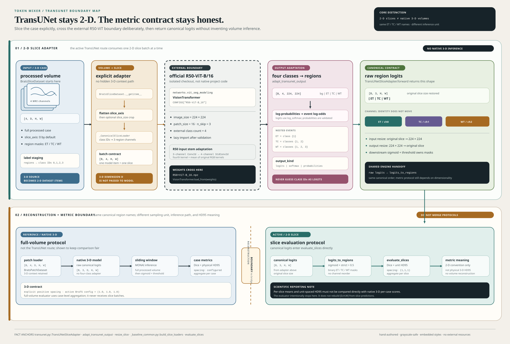

# TransUNet Slice Protocol

This guide documents the active TransUNet path. The supported implementation
wraps the official Beckschen/TransUNet R50-ViT-B/16 model as a 2-D slice
adapter. It is not a native 3-D model, and its evaluator does not reconstruct a
volume before computing metrics.

## Architecture Diagram

 summarizes
the volume-to-slice boundary, external 2-D model boundary, and canonical output
conversion described below.

## Source Map

Runtime behavior is defined by these active symbols:

- [`src/token_mixer/models/transunet.py::validate_transunet_config`](../src/token_mixer/models/transunet.py#L379-L387), [`src/token_mixer/models/transunet.py::_config_values`](../src/token_mixer/models/transunet.py#L307-L353), and [`src/token_mixer/models/transunet.py::_validate_external_paths`](../src/token_mixer/models/transunet.py#L356-L377) validate configuration and external assets before import.
- [`src/token_mixer/models/transunet.py::get_transunet_metadata`](../src/token_mixer/models/transunet.py#L390-L406) defines the dimensionality and canonical output metadata.
- [`src/token_mixer/models/transunet.py::adapt_transunet_output`](../src/token_mixer/models/transunet.py#L428-L489) converts the external four-class output to canonical region logits.
- [`src/token_mixer/models/transunet.py::resize_slice`](../src/token_mixer/models/transunet.py#L492-L547) is the public 2-D interpolation helper; [`src/token_mixer/models/transunet.py::TransUNetSliceAdapter.forward`](../src/token_mixer/models/transunet.py#L594-L635) owns model-boundary resizing.
- [`src/token_mixer/models/transunet.py::TransUNetSliceAdapter`](../src/token_mixer/models/transunet.py#L550-L592) exposes the 2-D tensor contract and shared `encoder` seam.
- [`src/token_mixer/models/transunet.py::build_transunet`](../src/token_mixer/models/transunet.py#L777-L849), [`src/token_mixer/models/transunet.py::_import_external_api`](../src/token_mixer/models/transunet.py#L638-L701), [`src/token_mixer/models/transunet.py::_load_pretrained`](../src/token_mixer/models/transunet.py#L704-L723), [`src/token_mixer/models/transunet.py::_adapt_input_stem`](../src/token_mixer/models/transunet.py#L741-L775), and [`src/token_mixer/models/transunet.py::load_transunet_state_dict`](../src/token_mixer/models/transunet.py#L726-L738) own construction and weight boundaries.
- [`src/token_mixer/pipelines/train_transunet.py::run_transunet`](../src/token_mixer/pipelines/train_transunet.py#L64-L88), [`src/token_mixer/pipelines/train_transunet.py::_build_model`](../src/token_mixer/pipelines/train_transunet.py#L64-L69), and [`src/token_mixer/pipelines/train_transunet.py::build_loaders`](../src/token_mixer/pipelines/train_transunet.py#L31-L33) connect the adapter to the shared training path.
- [`src/token_mixer/pipelines/_baseline_common.py::build_slice_loaders`](../src/token_mixer/pipelines/_baseline_common.py#L530-L575), [`src/token_mixer/pipelines/_baseline_common.py::_CanonicalSliceLoader`](../src/token_mixer/pipelines/_baseline_common.py#L498-L528), [`src/token_mixer/pipelines/_baseline_common.py::build_slice_evaluator`](../src/token_mixer/pipelines/_baseline_common.py#L789-L796), and [`src/token_mixer/pipelines/_baseline_common.py::evaluate_slices`](../src/token_mixer/pipelines/_baseline_common.py#L694-L786) define loading, target conversion, and slice metrics.
- [`src/token_mixer/data/datasets.py::BratsSliceDataset`](../src/token_mixer/data/datasets.py#L94-L144), [`src/token_mixer/data/labels.py::regions_to_multiclass`](../src/token_mixer/data/labels.py#L50-L59), and [`src/token_mixer/data/labels.py::multiclass_to_regions`](../src/token_mixer/data/labels.py#L62-L68) define volume-to-slice and label conversion.
- [`configs/model/transunet.yaml`](../configs/model/transunet.yaml#L1-L12), [`configs/experiment/transunet.yaml`](../configs/experiment/transunet.yaml#L1-L32), [`configs/data/brats.yaml`](../configs/data/brats.yaml#L1-L22), [`configs/run/debug.yaml`](../configs/run/debug.yaml#L1-L17), and [`configs/run/full.yaml`](../configs/run/full.yaml#L1-L17) define shipped defaults.
- [`tests/models/test_transunet_config.py`](../tests/models/test_transunet_config.py#L98-L336), [`tests/pipelines/test_baseline_pipelines.py`](../tests/pipelines/test_baseline_pipelines.py#L253-L394), and [`tests/data/test_datasets.py`](../tests/data/test_datasets.py#L170-L211) protect asset validation, output adaptation, resizing, injected backends, pipeline ordering, and slice shapes.

The external architecture is grounded in Chen et al., *TransUNet: Transformers
Make Strong Encoders for Medical Image Segmentation*, and the
[official Beckschen/TransUNet implementation](https://github.com/Beckschen/TransUNet).
The repository's implementation reference is recorded in the module docstring;
this guide makes no claim that an external checkout or pretrained asset is
present in this repository.

## Boundary At A Glance

The active path has these boundaries:

```text
BraTS case: four 3-D MRI volumes + segmentation
  |
  | BratsSliceDataset: preprocess volume, choose slice_axis, flatten slices
  |                   and emit [4, H, W] + class IDs 0..3
  v
CanonicalSliceLoader: batch images as [B, 4, H, W]
  |                   convert class IDs to [B, 3, H, W] ET/TC/WT targets
  v
TransUNetSliceAdapter
  | input bilinear resize -> configured image_size, normally [224, 224]
  | ---------------------- external R50-ViT-B/16 checkout boundary ----------
  | external four-class output [B, 4, h, w]
  | adapt_transunet_output -> three canonical raw region logits
  | output bilinear resize -> original slice H, W
  v
run_2d_baseline -> evaluate_slices
  | sigmoid + threshold for binary metrics
  | per-slice Dice and unit-spaced HD95; no slice-to-volume reconstruction
  v
canonical metrics and FitResult
```

The external model boundary is deliberately visible. The adapter supplies the
canonical interface expected by the package, but it does not turn the external
network into a 3-D network or add a volume reconstruction step.

## Tensor Contract

The effective runtime contract is:

| Boundary | Shape or value | Meaning |
| --- | --- | --- |
| Slice input | `[B, 4, H, W]` | Four MRI channels in `t1n`, `t1c`, `t2w`, `t2f` order. |
| External input | `[B, 4, image_size[0], image_size[1]]` | Bilinearly resized slice consumed by the official model. |
| External output | `[B, 4, h, w]` | `0=background`, `1=ET`, `2=TC`, `3=WT`. |
| Adapter output | `[B, 3, H, W]` | Raw canonical logits in `ET`, `TC`, `WT` order. |
| Metric prediction | `[B, 3, H, W]` | `logits_to_regions` applies sigmoid and the shared threshold. |

`get_transunet_metadata()` reports `dimensionality: "2-D"`,
`spatial_dims: 2`, `slice_based: true`, `native_3d: false`, and the input and
output layouts. `TransUNetSliceAdapter` extends that metadata with the active
four-channel input, configured image size, and selected output kind. The adapter
also exposes `encoder`: it selects an external `encoder` or `transformer`
module when available, otherwise the external model itself. This is the seam
used by shared parameter grouping; it is not evidence that the network is
native 3-D.

The model group sets `num_classes: 4` for the external network while recording
`canonical_num_classes: 3`. The builder always constructs the supported
external API with four output classes, then the adapter returns three canonical
channels. The source-level config parser also accepts `num_classes: 3`, but the
final `TransUNetSliceAdapter` requires four MRI input channels and the active
model config is the supported four-channel path.

## External Checkout And Weights

Non-injected construction requires both an official checkout and a compatible
pretrained `.npz` file. The configured checkout root must contain all of these
files:

```text
<TRANSUNET_ROOT>/
`-- networks/
    |-- vit_seg_modeling.py
    |-- vit_seg_modeling_resnet_skip.py
    `-- vit_seg_configs.py
```

The files must expose the official `VisionTransformer`, `CONFIGS`, and
`StdConv2d` API. `CONFIGS` must contain `R50-ViT-B_16`. The pretrained path must
be a file readable by NumPy and compatible with the external model's
`VisionTransformer.load_from(weights)` method. A file that merely has an `.npz`
suffix is not sufficient.

The repository does not contain the external checkout or weights. Follow the
official repository's checkout and asset instructions, keep both assets outside
the reviewed source tree, and export their paths locally:

```bash
export TRANSUNET_ROOT=/path/to/TransUNet
export TRANSUNET_PRETRAINED=/path/to/R50+ViT-B_16.npz
```

The README environment contract is explicit: the CLI does not substitute these
environment variables into Hydra configuration. Pass them to the exact config
keys when running the experiment:

```bash
uv run python -m token_mixer \
  --config-name local \
  experiment=transunet run=debug device=cpu \
  third_party.transunet_root="$TRANSUNET_ROOT" \
  third_party.pretrained_path="$TRANSUNET_PRETRAINED"
```

The corresponding README contract is [`README.md::Runtime environment variables`](../README.md#L94-L111)
and [`README.md::TransUNet debug command`](../README.md#L411-L429). The
`third_party.pretrained_path` value is preferred by the active configuration
resolver, but `model.pretrained_path` and the other supported aliases are also
accepted by [`src/token_mixer/models/transunet.py::_resolve_pretrained_value`](../src/token_mixer/models/transunet.py#L174-L185). The model YAML leaves its
model-level value `null`; the actual non-injected run must receive a path from a
Hydra override or composed configuration.

## Validation And Lazy Import

Validation is intentionally split from import and construction:

1. `run_transunet` calls `validate_transunet_config` before entering
   `run_2d_baseline` when no injected external model is configured.
2. `validate_transunet_config` accepts only a mapping, resolves required root
   and pretrained paths, validates supported model geometry and class settings,
   then checks the root directory, `.npz` file, and three required source files.
   It performs no import from the external checkout.
3. `build_transunet` repeats the configuration/path boundary before calling
   `_import_external_api`. This keeps direct builder use safe even when it does
   not pass through the pipeline.
4. `_import_external_api` loads the external modules under a unique temporary
   package name and removes those names from `sys.modules` in `finally`. It does
   not add the checkout to `sys.path`.
5. The builder copies `CONFIGS["R50-ViT-B_16"]`, sets four external classes,
   applies `n_skip`, pretrained path, and token-grid geometry, constructs the
   official `VisionTransformer`, loads the `.npz`, adapts the input stem, and
   returns `TransUNetSliceAdapter`.

Injected construction is a separate test and controlled-integration seam:
`external_model` or `external_network` may provide an already-created
`torch.nn.Module`. That path does not require checkout or `.npz` paths, and an
optional `external_state` is loaded with strict `load_state_dict` through
`load_transunet_state_dict`. It is useful for unit tests and does not validate
the real official implementation.

## Input Stem Adaptation

The official R50 hybrid stem is expected at
`transformer.embeddings.hybrid_model.root.conv` and must start as a three-input
`nn.Conv2d`. For the active four-channel MRI path, `_adapt_input_stem` creates
an external `StdConv2d` with the same convolution geometry and dtype/device:

- Existing weights for channels 0 through 2 are copied unchanged.
- The fourth input channel is initialized from the mean of the original three
  input-channel weights.
- Bias is copied when present.

With three input channels, the stem is left unchanged by this helper, but the
returned `TransUNetSliceAdapter` still rejects non-four-channel input. Do not
use `model.in_channels=3` as an active CLI contract without changing and
testing the adapter boundary; the shipped TransUNet path is four-channel MRI.

## Slice Loading And Resize

`build_loaders` delegates to `build_slice_loaders`, which validates the shared
manifest and discovers complete cases before applying `run.max_cases`. It builds
`BratsSliceDataset` instances for train, validation, and test. The loader
metadata retains manifest path, hash, split identity, and split counts for the
training artifacts.

`BratsSliceDataset` loads the four aligned 3-D modalities, preprocesses each
case without 3-D crop keys, chooses `slice_axis` (default `0`; aliases include
`depth`, `axial`, `height`, `coronal`, `width`, and `sagittal`), and flattens the
selected axis into individual samples. It converts region masks to class IDs
with `regions_to_multiclass`, where more specific regions take priority:

```text
0 = background
1 = ET
2 = TC
3 = WT
```

An optional `slice_size` uses `crop_slice`: it pads when needed, then center
crops for evaluation or uses the configured training crop path. It is a 2-D
pad/crop operation, not the model's `image_size` interpolation. The
`_CanonicalSliceLoader` converts class IDs back to three binary region target
channels with `multiclass_to_regions` before the engine sees the batch.

There are two distinct resize utilities:

- `resize_slice` accepts `[H,W]`, `[C,H,W]`, or `[B,C,H,W]` NumPy/tensor inputs.
  It uses PyTorch interpolation, `bilinear` for continuous images and
  `nearest` for labels. NumPy nearest-neighbor labels retain their dtype and
  tensor inputs retain their device.
- `TransUNetSliceAdapter.forward` directly uses bilinear interpolation with
  `align_corners=False` to resize any positive input slice to `image_size`, then
  resizes adapted region logits back to the original slice size. The returned
  shape is checked against `(B, 3, H, W)`.

The active model config uses `image_size: [224, 224]`, `patch_size: 16`, and
`R50-ViT-B_16`. Official geometry validation requires a square image, square
patch size `16`, and image dimensions divisible by the patch size. Changing
`slice_size` changes dataset samples; changing `model.image_size` changes the
external model boundary and must satisfy those geometry checks.

## Four Classes To Three Regions

The external class mapping is fixed:

```text
external class 0: background
external class 1: ET
external class 2: TC
external class 3: WT
```

`adapt_transunet_output` accepts only finite four-channel tensors shaped
`[B, 4, H, W]`. It produces nested binary-event log-odds as three raw logits:

```text
ET = {1}       versus {0, 2, 3}
TC = {1, 2}    versus {0, 3}
WT = {1, 2, 3} versus {0}
```

For `output_kind: logits`, the adapter first applies `log_softmax` across the
four external classes and computes each event's log-sum-exp minus its
complement's log-sum-exp. It does not sum raw class logits. For `softmax` or
`probabilities`, input values must be non-negative and sum to one across class
channels; the adapter takes their clamped logarithm before computing the same
event log-odds. The singular spelling `probability` is normalized to
`probabilities` by the active source, but use the plural config value.

Scalar class IDs, non-finite values, wrong channel counts, negative
probabilities, and non-normalized probability tensors are rejected. The output
is always raw canonical logits. Shared `logits_to_regions` owns sigmoid and
thresholding later at the metric boundary; training uses
`binary_cross_entropy_with_logits` from the TransUNet experiment config.

## Output Kinds And Metadata

`model.output_kind` supports exactly:

| Value | External model output expected | Adapter behavior |
| --- | --- | --- |
| `logits` | Unnormalized four-class logits | Apply `log_softmax`, then event log-odds. |
| `softmax` | Four non-negative probabilities summing to one | Validate, log, then event log-odds. |
| `probabilities` | Same normalized probability contract | Same as `softmax`. |

The model config defaults to `logits`. `TransUNetSliceAdapter.metadata` records
the selected kind, but the adapter's public output remains raw canonical logits
for every kind. This distinction matters for loss selection and for avoiding a
second sigmoid or softmax at the wrong boundary.

## Training Path

`run_transunet` supplies the adapter to [`src/token_mixer/pipelines/_baseline_common.py::run_2d_baseline`](../src/token_mixer/pipelines/_baseline_common.py#L1264-L1351) with
these builders:

- `build_loaders` -> manifest-backed slice loaders.
- `_build_evaluator` -> `build_slice_evaluator` and `evaluate_slices` unless a
  callable evaluator override is provided.
- `_build_loss` -> `binary_cross_entropy_with_logits` by default.
- `_build_phases` -> the single `train` phase in
  [`configs/experiment/transunet.yaml`](../configs/experiment/transunet.yaml#L9-L32).
- `_build_checkpoints`, `create_tracker`, and `fit` -> shared checkpoint,
  tracking, and training engine seams.

The shipped phase uses `encoder_lr: 1e-4`, `decoder_lr: 1e-4`, `freeze_encoder:
false`, AdamW with weight decay `1e-4`, a cosine epoch scheduler, and `mean_dice`
maximized for checkpoint selection. `debug` uses two cases, batch size one,
one epoch, zero workers, AMP disabled, and seed 42. `full` uses no case limit,
batch size two, 80 phase-2 epochs, eight workers, AMP enabled, and the same
seed/deterministic flag. These are run-group settings, not evidence that either
run has been executed.

## Metrics And Unit Spacing

The slice evaluator does not call MONAI sliding-window inference and does not
stack predictions back into a 3-D volume. For each slice batch it:

1. Calls the adapter and receives `[B, 3, H, W]` raw logits.
2. Calls `logits_to_regions` for binary metric masks.
3. Adds a singleton depth dimension only so the shared Dice/HD95 functions can
   consume their channel-first metric seam.
4. Calls `_slice_metrics`, which passes `(1.0, 1.0, 1.0)` to `hd95_by_region`.
5. Averages region metrics across slices and records one-empty HD95 exclusions.

That three-value spacing is a unit-spaced 2-D convention, not physical spacing
for a reconstructed 3-D case. The active `configs/data/brats.yaml` spacing
`[1.0, 1.0, 1.0]` belongs to the native 3-D volume evaluator contract; the
TransUNet slice evaluator supplies its own unit spacing. Do not describe a
TransUNet slice HD95 as physical full-volume HD95.

## 2-D Versus Native 3-D

| Concern | TransUNet active path | Native 3-D baselines |
| --- | --- | --- |
| Input | `[B, 4, H, W]` slice batches | `[B, 4, D, H, W]` volumes or patches |
| Data builder | `build_slice_loaders` / `BratsSliceDataset` | `build_volume_loaders` / volume datasets |
| Model output | External `[B,4,H,W]` adapted to `[B,3,H,W]` | `[B,3,D,H,W]` raw region logits |
| Inference | Direct per-slice model call | MONAI sliding-window full-volume inference |
| Reconstruction | None in loader, adapter, or evaluator | Full volume remains available for case-level metrics |
| HD95 spacing | Unit `(1,1,1)` inside `_slice_metrics` | Explicit configured or per-case positive spacing |
| Aggregation | Per slice, then mean by region | Per case, then mean by region |
| Scientific comparison | Must be reported as 2-D slice protocol | Must be reported as native 3-D protocol |

This is a protocol distinction, not only a shape distinction. Dice and HD95
from the two paths should not be presented as directly equivalent without
labeling their sampling unit, reconstruction behavior, and spacing convention.

## CLI Overrides And Preflight

Use `--cfg job` to inspect composition without dispatching or validating assets:

```bash
uv run python -m token_mixer \
  --config-name local experiment=transunet run=debug --cfg job
```

That output is configuration evidence only. It does not prove that the
manifest, BraTS cases, external checkout, `.npz`, or external dependencies are
usable. For an actual run, common overrides are:

```text
third_party.transunet_root=/path/to/TransUNet
third_party.pretrained_path=/path/to/R50+ViT-B_16.npz
model.output_kind=softmax
model.image_size=[224,224]
data.slice_axis=coronal
data.slice_size=[224,224]
run.max_cases=2
device=cpu
```

Hydra applies overrides after selected group values. Keep `model.image_size`
square, divisible by `model.patch_size`, and compatible with the official
R50-ViT-B/16 geometry. `data.slice_size` is optional and controls dataset
pad/crop; it is not a substitute for the model image size. `run.max_cases` is
applied only after manifest validation and case-ID mapping.

## Failure Modes

| Failure | Where it is detected | Meaning or action |
| --- | --- | --- |
| Missing `third_party.transunet_root` or pretrained path | `validate_transunet_config` / `build_transunet` | Supply both paths for non-injected construction. |
| Root is not a directory, `.npz` is not a file, or required `networks/*` file is absent | `_validate_external_paths` | Fix checkout root or asset path before import. |
| Unsupported `vit_name`, patch size, image geometry, class count, `n_skip`, or output kind | `_model_values` | Use shipped R50-ViT-B/16 values and supported output kinds. |
| External module API cannot import or lacks `VisionTransformer`, `CONFIGS`, or `StdConv2d` | `_import_external_api` | Use a compatible official checkout and its dependencies. |
| `.npz` cannot be consumed by `load_from(weights)` | `_load_pretrained` | Use the compatible official R50-ViT-B/16 pretrained asset. |
| R50 stem is missing or not a three-channel `nn.Conv2d` | `_adapt_input_stem` | Checkout does not match the supported hybrid R50 boundary. |
| Input is not `[B,4,H,W]`, has wrong channels, or non-positive spatial size | `TransUNetSliceAdapter.forward` | Fix loader/config/model input contract. |
| External output is not finite `[B,4,H,W]` | `adapt_transunet_output` | Fix external model output; no class-ID guessing is performed. |
| `softmax`/`probabilities` output is negative or does not sum to one | `adapt_transunet_output` | Set the correct `output_kind` or return normalized probabilities. |
| Missing manifest, case ID, or complete four-modality case | shared loader builders | Prepare the selected data root and shared manifest; debug limits do not hide mismatches. |
| Missing checkpoint during post-fit test evaluation | `run_2d_baseline` shared path | Inspect the fit/checkpoint configuration; the test evaluator requires restored `best.pt`. |

The pipeline test specifically verifies that missing external checkout validation
raises before model construction, seeding, or fitting. It does not make the
missing asset available.

## Validation Limits

The active tests intentionally separate boundary validation from real external
integration:

- Unit tests use fake checkouts, injected `nn.Module` backends, synthetic
  tensors, and temporary files to test validation order, output conversion,
  resize behavior, metadata, encoder exposure, and pipeline seams.
- The external integration test skips only when either environment variable is
  unset, or when the configured root is not a directory or the configured
  pretrained path is not a file. When both configured paths exist, the test
  attempts official construction; an incomplete or malformed checkout, an
  incompatible external API, or an unreadable/incompatible `.npz` fails the
  test rather than being skipped. A skip is not validation of the external
  checkout or `.npz`.
- The repository's README verification snapshot explicitly does not claim a
  real external TransUNet integration, real BraTS run, full cloud training, or
  pretrained-asset validation.

Therefore, passing local tests proves the documented interfaces and failure
behavior, not official weight compatibility, external dependency resolution,
training convergence, segmentation quality, or comparability with a native
3-D experiment. Record a real external run with its checkout, weight, data,
manifest, config, and output identity before making those claims.

## Related Guides

- [Configuration Flow](CONFIG.md) owns Hydra composition and override semantics.
- [Evaluation](EVALUATE.md) owns shared logit conversion, metric definitions,
  spacing rules, and the cross-model 2-D/3-D evaluation distinction.
- [Data](DATA.md) owns BraTS preparation, manifests, labels, and transforms.
- [Training](TRAINING.md) owns phases, checkpoints, resume, tracking, and
  artifacts.
- [Testing](TESTING.md) owns test taxonomy and evidence limits.
